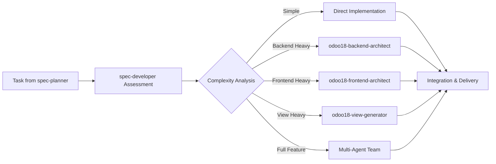

# CLAUDE.md

This file provides guidance to Claude Code (claude.ai/code) when working with code in this repository.

## Project Overview

Claude Sub-Agent Spec Workflow System - A comprehensive AI-driven development workflow system built on Claude Code's Sub-Agents feature with **Structured Response Architecture**. This system transforms project ideas into production-ready implementation plans through specialized AI agents working in coordinated research phases with 10x token efficiency.

## Project Documentation Conventions (Important)

**Documentation Files:** All new documentation or task files must be saved under the `docs/` folder in this repository.For example:

- **Tasks & TODOs**: Save in `docs/{YYYY_MM_DD}/tasks/` (e.g., `docs/t2025_08_08/asks/ReleaseTodo.md` for a release checklist).
- **Requirements/Specs**: Save in `docs/{YYYY_MM_DD}/specs/` (e.g., `docs/2025_08_08/specs/AuthModuleRequirements.md`).
- **Design Docs**: Save in `docs/{YYYY_MM_DD}/design/` (e.g., `docs/2025_08_08/design/ArchitectureOverview.md`).
- **Code Files:** Follow the project structure (place new code in the appropriate src/module folder as discussed).
- **Tests:** Put new test files under the `tests/` directory, mirroring the code structure.

> **Important:** When creating a new file, ensure the directory exists or create it. Never default to the root directory for these files.

## Common Development Commands

### Workflow Execution

```bash
# Execute complete structured response workflow with Tech Leader coordination
/agent-workflow "Create an Odoo inventory management module with barcode scanning"

# Start workflow manually with orchestrator (includes structured response coordination)
Use spec-orchestrator: Research and plan enterprise Odoo CRM extension with multi-tenancy support

# Phase-specific research execution (returns structured responses for plan creation)
Use spec-analyst: Research requirements for an Odoo e-commerce integration
Use spec-architect: Research system architecture for Odoo microservices
Use spec-developer: Research task complexity and coordinate development planning for user authentication

# Direct specialist research (outside workflow - for isolated research only)
Use odoo18-backend-architect: Research complex multi-company workflow for existing module
Use odoo18-frontend-architect: Research advanced dashboard widget for specific requirement
Use odoo18-view-generator: Research standard views for new model

# Tech Leader coordination examples (structured response approach)
Use spec-developer: Research complete Odoo module with intelligent agent delegation
Use spec-developer: Research task complexity and coordinate appropriate specialists for [FEATURE]
Use spec-developer: Research and integrate specialist outputs for cohesive Odoo module planning
```

### Story Management and Progress Tracking

```bash
# Create user stories with BMad-Method integration
/create-story requirements.md --epic="User-System" --priority=High

# Track real-time progress with checkbox completion
/track-progress Epic-1-Story-2.1 --format=dashboard --detail=high

# Story lifecycle management
Use spec-story-manager: Create story for user authentication system
Use spec-progress-tracker: Generate comprehensive progress report for active stories

# Task planning with checkbox hierarchy
Use spec-planner: Break down story into tasks with 3-level checkbox tracking
```

### Document Sharding and Organization

```bash
# Automatic document sharding (triggered automatically for documents >500 lines)
/agent-workflow "Create comprehensive ERP system" 
# Large requirements and architecture documents are automatically sharded

# Manual document sharding
/shard-document architecture.md --threshold=400 --output=docs/sharded/

# Batch document sharding
/shard-document docs/ --pattern="*.md" --threshold=300

# Direct agent usage
Use doc-sharding-agent: Shard the large requirements document for better AI processing
```

### Quality Gates and Testing

```bash
# The system includes three automated quality gates:
# Gate 1: Planning Quality (95% threshold) - After spec-planner
# Gate 2: Development Quality (80% threshold) - After spec-tester  
# Gate 3: Production Readiness (85% threshold) - After spec-validator

# Manual validation
Use spec-validator: Evaluate code quality and provide scoring
Use spec-tester: Generate comprehensive test suite for the implementation
```

### Project Structure Operations

```bash
# Copy agents to a new project
mkdir -p .claude/agents .claude/commands
cp agents/* .claude/agents/
cp commands/agent-workflow.md .claude/commands/

# Organize agent files (current reorganization in progress)
# Backend agents: agents/backend/
# Frontend agents: agents/frontend/ 
# Spec workflow agents: agents/spec-agents/
# UI/UX agents: agents/ui-ux/
# Utility agents: agents/utility/
```

## System Architecture with Structured Response Design

### Multi-Phase Research & Planning Workflow

The system follows a three-phase structured response approach with quality gates:

1. **Research Phase (20-25% of project time) - Structured Responses**
   - spec-analyst: Requirements research → structured response → requirements_plan.md
   - spec-story-manager: Story research → structured response → stories_plan.md
   - spec-architect: Architecture research → structured response → architecture_plan.md
   - spec-planner: Task planning research → structured response → tasks_plan.md
   - Quality Gate 1: 95% planning completeness threshold

2. **Development Planning Phase (60-65% of project time) - Tech Leader Coordination**
   - spec-developer: Task complexity research → structured response → development_plan.md
   - Specialist coordination: Research delegation to domain experts
   - spec-progress-tracker: Real-time planning progress monitoring
   - spec-tester: Test planning research → structured response → test_plan.md
   - Quality Gate 2: 95% development planning completeness threshold

3. **Validation & Readiness Phase (15-20% of project time) - Final Assessment**
   - spec-reviewer: Review planning research → structured response → review_plan.md
   - spec-validator: Production readiness research → structured response → validation_report.md
   - Quality Gate 3: 95% implementation readiness threshold

### Agent Categories

**Workflow Agents (spec-agents/)**

- spec-orchestrator: Workflow coordination and quality gate management
- spec-analyst: Requirements analysis specialist
- spec-story-manager: User story lifecycle management with BMad-Method integration
- spec-architect: System architecture designer  
- spec-planner: Task breakdown and checkbox tracking specialist
- **spec-developer: Tech Leader and development planning coordinator** (Enhanced Role with Structured Responses)
- spec-progress-tracker: Real-time progress monitoring and analytics
- spec-tester: Testing expert
- spec-reviewer: Code review specialist
- spec-validator: Final validation expert

**Domain Specialists**

- senior-frontend-architect: React/Vue/Next.js expert
- senior-backend-architect: Go/TypeScript backend systems
- ui-ux-master: UI/UX design and implementation

**Odoo Specialists (Research Coordination by spec-developer)**

- **odoo18-backend-architect**: Odoo 18 enterprise backend research and planning (Models, ORM, Business Logic)
- **odoo18-frontend-architect**: Odoo 18 OWL frontend research and planning (Components, Widgets, Client-side)
- **odoo18-view-generator**: Odoo 18 XML view research and planning (Forms, Lists, Kanban, Search views)

**Utility Agents**

- doc-sharding-agent: Document fragmentation and organization specialist
- refactor-agent: Code quality and refactoring specialist

### Quality Framework

Each phase includes automated quality gates with specific thresholds:

- Requirements completeness validation
- Architecture feasibility assessment
- Code quality metrics and test coverage
- Security vulnerability scanning
- Production deployment readiness

### Structured Response Communication Protocol

Agents communicate through structured response format for 10x token efficiency:

- Each sub-agent returns research in delimited format: `=== DOMAIN RESEARCH RESULTS START/END ===`
- Main agents parse structured responses and create plan files in .context/agent_plans/
- Next agents read plan files as input context
- Orchestrator manages the structured response workflow progression
- Quality gates ensure consistency and implementation readiness

### Key Benefits of Structured Response Architecture

- **10x Token Efficiency**: Eliminates conversation context pollution from file reads
- **Enhanced Research Quality**: Sub-agents focus purely on analysis and recommendations
- **Better Implementation Context**: Main agents have complete context for planning
- **Clear Accountability**: Research vs. planning responsibilities are distinct
- **Scalable Workflow**: Handle large, complex projects without context limits

## Expected Output Structure with Structured Response System

```
project/
├── .context/                     # Structured response coordination
│   ├── session_context.md       # Overall project state
│   ├── planning_context.md      # Planning phase context
│   ├── development_context.md   # Development phase tracking
│   └── agent_plans/             # Plan files from structured responses
│       ├── requirements_plan.md      # From spec-analyst research
│       ├── stories_plan.md          # From spec-story-manager research
│       ├── architecture_plan.md     # From spec-architect research
│       ├── tasks_plan.md           # From spec-planner research
│       ├── development_plan.md     # From spec-developer research
│       ├── test_plan.md           # From spec-tester research
│       ├── review_plan.md         # From spec-reviewer research
│       └── validation_report.md   # From spec-validator research
├── docs/
│   ├── requirements.md      # Final implementation-ready requirements
│   ├── architecture.md      # Final implementation-ready architecture
│   ├── api-spec.md         # API specifications and contracts
│   └── user-stories.md     # User stories with acceptance criteria
├── src/                    # Ready for external implementation
│   ├── components/         # Based on frontend_plan.md
│   ├── services/          # Based on backend_plan.md
│   ├── utils/             # Based on development_plan.md
│   └── types/             # Based on architecture_plan.md
├── tests/
│   ├── unit/              # Unit tests
│   ├── integration/       # Integration tests
│   └── e2e/               # End-to-end tests
├── package.json           # Project dependencies
└── README.md              # Project documentation
```

## Key Integration Points

### Slash Command Integration

The `/agent-workflow` command provides one-command execution of the entire development pipeline:

- Supports quality threshold configuration (--quality=75-95)
- Allows agent skipping (--skip-agent=spec-analyst)
- Phase-specific execution (--phase=planning|development|validation)
- Language selection (--language=zh|en)

### Enhanced Sub-Agent Chain Process with Tech Leader Coordination

The system uses Claude Code's sub-agent syntax for coordinated execution with Tech Leader delegation and BMad-Method story integration:

```
First use the spec-analyst sub agent → then spec-story-manager sub agent || spec-architect sub agent (parallel) → then spec-planner sub agent → then spec-developer sub agent as Tech Leader to assess task complexity and coordinate development through intelligent delegation: [SIMPLE TASKS: implement directly | COMPLEX BACKEND: coordinate with odoo18-backend-architect | COMPLEX FRONTEND: coordinate with odoo18-frontend-architect | STANDARD VIEWS: coordinate with odoo18-view-generator | MIXED REQUIREMENTS: coordinate multi-agent team] → then spec-progress-tracker sub agent to monitor Tech Leader coordination → then spec-tester sub agent || spec-reviewer sub agent (parallel) → then spec-validator sub agent → quality gate decision → if score ≥95% continue to deployment, otherwise loop back with feedback based on progress analysis
```

### Tech Leader Coordination Model

**spec-developer** now serves as the central Tech Leader with enhanced responsibilities:

#### **🎯 Task Complexity Assessment Matrix**
- **Simple Tasks**: Standard CRUD, basic views, simple API endpoints → Direct implementation
- **Complex Backend**: Multi-company workflows, advanced ORM, enterprise business logic → odoo18-backend-architect
- **Complex Frontend**: Custom OWL components, interactive dashboards, advanced widgets → odoo18-frontend-architect  
- **Standard Views**: XML forms, lists, kanban, search views → odoo18-view-generator
- **Mixed Requirements**: Full module development, cross-component features → Multi-agent coordination

#### **🔧 Coordination Workflow**


### Quality Gate Mechanism

- Validation Score ≥95%: Proceed to next phase
- Validation Score <95%: Loop back with specific feedback
- Maximum 3 iterations to prevent infinite loops
- Expected progression: Round 1 (80-90%) → Round 2 (90-95%) → Round 3 (95%+)

## Best Practices

### For Working with Agents

- **Start with spec-orchestrator** for complete projects
- **Trust the Tech Leader model**: Let spec-developer make delegation decisions
- **Use direct specialist calls** only for isolated tasks outside the workflow
- Allow each agent to complete their phase before intervention
- Trust the quality gate system for consistent standards
- Review artifacts between phases for course correction

### For Tech Leader Coordination

- **Let spec-developer assess complexity**: Don't pre-determine which specialist to use
- **Review delegation decisions**: Check if complexity assessment was appropriate
- **Monitor integration quality**: Ensure specialist outputs work together
- **Track coordination metrics**: Use spec-progress-tracker for insights

### For Project Setup

- Copy all agents and slash command to project's .claude directory
- Provide clear project descriptions with constraints and requirements
- Specify quality expectations (75% for prototypes, 95% for enterprise)
- Include existing documentation when available

### For Customization

- Adjust quality thresholds based on project needs
- Skip agents for simpler projects (e.g., skip spec-analyst if requirements exist)
- Use phase-specific execution for targeted improvements
- Integrate with existing CI/CD workflows

## Troubleshooting

### Common Issues

- **Agent Not Found**: Verify agents are in correct .claude/agents directory
- **Quality Gate Failures**: Review specific criteria, allow agents to revise work
- **Workflow Stuck**: Check orchestrator status, restart from last checkpoint

### Debug Mode

Enable verbose logging by requesting: "Use spec-orchestrator with debug mode and show all agent interactions"

## Integration with External Systems

The system can be integrated with:

- GitHub Actions for CI/CD validation
- Custom quality gates and validation criteria  
- Domain-specific workflows and specialized orchestrators
- Existing development tools and frameworks
