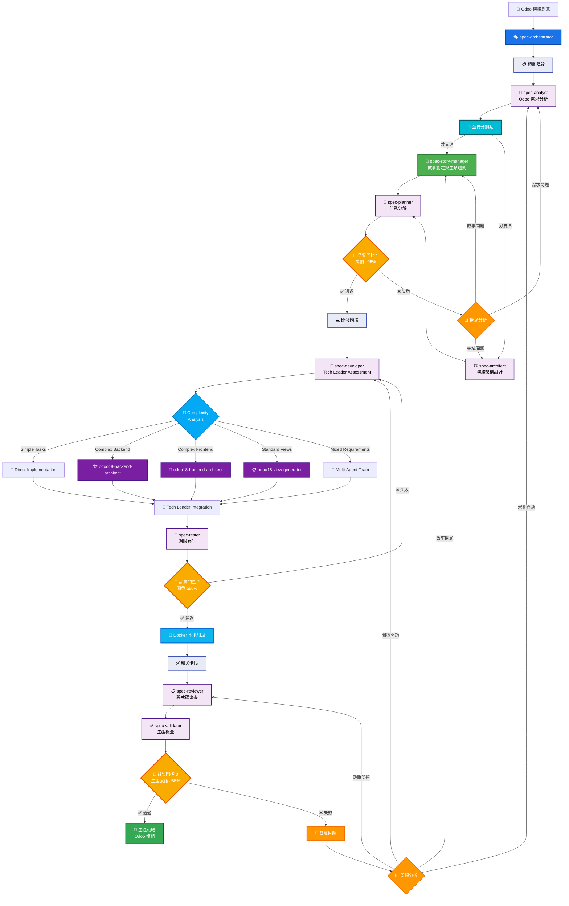

# Claude Sub-Agent Spec 工作流程系統

> **Language / 語言**: [English](README.md) | [简体中文](README-zh.md) | [繁體中文](README-zht.md)

基於 Claude Code Sub-Agents 功能構建的綜合性 AI 驅動開發工作流程系統。該系統透過協調多個專業化 AI 代理，將專案創意轉化為生產就緒的程式碼。

## 目錄

- [概述](#概述)
- [系統架構](#系統架構)
- [安裝指南](#安裝指南)
- [快速開始](#快速開始)
- [Slash 指令使用](#slash-指令使用)
- [工作原理](#工作原理)
- [Agent 參考](#agent-參考)
- [使用範例](#使用範例)
- [品質門控](#品質門控)
- [最佳實踐](#最佳實踐)
- [進階用法](#進階用法)
- [疑難排解](#疑難排解)

## 概述

Spec 工作流程系統利用 Claude Code 的 Sub-Agents 功能創建了一個多代理開發流水線。每個代理都是特定領域的專家，負責軟體開發生命週期的特定方面，從需求分析到最終驗證。

### 核心特性

- **自動化工作流程**：從創意到生產程式碼的完整開發流水線
- **故事驅動開發**：BMad-Method 整合與使用者故事生命週期管理
- **進度追蹤**：即時任務完成追蹤與 3 層級核取方塊階層
- **文件分片**：大型文件自動分割以提升 AI 處理效能
- **專業化專長**：每個代理專注於其專業領域
- **品質門控**：自動化檢查點確保品質標準
- **彈性整合**：可與現有專業代理協同工作
- **全面文件**：每個階段都生成詳細的文件

### 主要優勢

- 從概念到程式碼的開發速度提升 10 倍
- 故事驅動開發與清晰的驗收條件和進度追蹤
- 即時速度分析和阻礙識別
- 自動文件分割以最佳化 AI 處理和協作效果
- 透過自動化驗證確保一致的品質
- 自動生成全面的文件
- 透過系統化流程減少錯誤
- 透過清晰的工作流程和核取方塊進度可見性改善協作

## 系統架構

### 多代理 Odoo 18 開發流水線



## 安裝指南

### 前置需求

- Claude Code（最新版本）
- 已初始化的專案目錄
- 對 AI 輔助開發的基本了解

### 安裝步驟

1. **下載代理檔案**

   ```bash
   # 方式 1：複製儲存庫
   git clone https://github.com/zhsama/claude-sub-agent.git
   cd claude-sub-agent
   
   # 方式 2：下載所需的特定代理
   # 個別代理檔案可在 agents/ 目錄中取得
   ```

2. **複製代理和 slash 指令到專案的 Claude Code 目錄**

   ```bash
   # 在你的專案中建立 .claude 目錄結構
   mkdir -p ../.claude/agents ../.claude/commands ../.claude/template ../.claude/config ../.claude/hooks ../.claude/docker
   
   # 從分類目錄複製所有代理
   cp -r agents/*/*.md ../.claude/agents/
   
   # 複製所有 slash 指令
   cp commands/*.md ../.claude/commands/
   
   # 複製模板目錄
   cp -r templates/*.md ../.claude/template/
   
   # 複製 hooks（用於事件驅動自動化）
   cp -r hooks/*.sh ../.claude/hooks/
   
   # 複製配置範例（選用 - 用於 Odoo.sh 整合）
   cp config/odoo-sh.example.json ../.claude/config/
   
   # 複製 Docker 測試環境（用於快速本地 Odoo 測試）
   cp -r docker/* ../.claude/docker/
   ```

3. **新增規則到 CLAUDE.md**

   ```md
   ## 專案文件約定 (重要)

   **文件檔案：** 所有新的文件或任務檔案都必須按模組和版本組織儲存在 `docs/` 資料夾下。例如：

   - **模組需求**：儲存在 `docs/{module_name}/v{version}/requirements.md` (例如 `docs/ai_chat/v1.0.0/requirements.md`)
   - **架構規格**：儲存在 `docs/{module_name}/v{version}/architecture.md` (例如 `docs/ai_chat/v1.0.0/architecture.md`)
   - **API 文件**：儲存在 `docs/{module_name}/v{version}/api-spec.md`
   - **使用者故事**：儲存在 `docs/{module_name}/v{version}/user-stories.md`
   - **遷移指南**：儲存在 `docs/{module_name}/v{version}/migration-guide.md`
   - **整合文件**：儲存在 `docs/integration/` 用於跨模組文件
   - **全域標準**：儲存在 `docs/global/` 用於專案層級標準

   **文件分片：** 對於大型文件（>500 行），使用自動分片：
   - **分片文件**：儲存在 `docs/{module_name}/v{version}/{document_name}/` 目錄
   - **索引檔案**：維護 `docs/{module_name}/v{version}/{document_name}.md` 作為入口點
   - **章節檔案**：個別章節如 `01-introduction.md`、`02-architecture.md` 等
   - **導覽**：在章節間包含交叉參照以便於導覽

   **故事管理：** 對於 BMad-Method 故事驅動開發：
   - **故事**：儲存在 `stories/{epic_name}/` 目錄
   - **故事檔案**：命名為 `epic-{N}-story-{N.N}-{title}.md`
   - **進度追蹤**：使用 3 層級核取方塊階層（任務 → 子任務 → 行動項目）
   - **模板**：使用 `templates/story-template.md` 確保一致性

   **框架特定檔案：** 遵循框架約定：
   - **Odoo 模組**：放在 `user/{module_name}/` 使用標準結構
   - **React/Next.js**：放在 `src/` 使用元件導向組織
   - **後端服務**：放在適當的服務目錄

   > **重要提示：** 始終遵循命名約定並確保適當的國際化。對大型檔案使用文件分片以最佳化 AI 處理。
   ```

4. **配置 Claude Code Hooks（推薦）**

   Claude Code Hooks 提供事件驅動的 odoo.sh 部署監控自動化：

   ```bash
   # 使 hooks 可執行
   chmod +x .claude/hooks/*.sh
   
   # Hooks 將在以下情況下自動啟動：
   # 1. post-git-push-hook.sh - 在 git push 操作後觸發
   # 2. deployment-ready-hook.sh - 在部署監控檢測到就緒時觸發
   ```

   **Hook 優勢：**
   - **事件驅動**：由 git 操作自動觸發
   - **背景監控**：非阻塞式部署進度追蹤
   - **智慧測試**：部署就緒時自動執行測試
   - **全面報告**：詳細的部署和測試報告

5. **設定 Docker 本地測試環境（推薦用於 Odoo 專案）**

   對於 Odoo 開發專案，設定快速本地 Docker 測試：

   ```bash
   # 進入 Docker 目錄
   cd .claude/docker
   
   # 快速設定（自動化）
   ./scripts/docker-setup.sh
   
   # 或手動設定
   docker-compose up -d
   ```

   **Docker 環境優勢：**
   - ⚡ **快10倍**：30-60秒測試 vs odoo.sh的5+分鐘
   - 🔒 **可靠**：無連線問題或遠端依賴
   - 🎯 **全面**：單元、整合和E2E測試
   - 🚀 **自信部署**：本地修復問題後再部署到odoo.sh

   **存取服務：**
   - **Odoo**: http://localhost:8069 (admin/admin_secure_2024)
   - **pgAdmin**: http://localhost:8080 (使用 `--profile tools`)
   - **MailHog**: http://localhost:8025 (使用 `--profile tools`)

   **快速測試：**
   ```bash
   # 測試 AI 模組
   ./.claude/docker/scripts/docker-test.sh
   
   # 使用詳細輸出測試特定模組
   ./.claude/docker/scripts/docker-test.sh -m ai_chat,ai_config -v
   ```

6. **配置 Odoo.sh 整合（選用）**

   在本地測試後，為 odoo.sh 的二次驗證：

   ```bash
   # 複製範例配置
   cp .claude/config/odoo-sh.example.json .claude/config/odoo-sh.json
   
   # 編輯配置檔案，填入你的 odoo.sh 詳細資訊
   # 更新 SSH 主機、環境和模組設定
   ```

   **配置範例：**
   ```json
   {
     "environments": {
       "staging": {
         "ssh_host": "your-user@your-project-stage.dev.odoo.com",
         "ssh_key_path": "~/.ssh/odoo_sh_key",
         "active": true
       }
     },
     "default_environment": "staging",
     "test_settings": {
       "default_modules": ["your_module", "your_other_module"]
     }
   }
   ```

   **測試配置：**
   ```bash
   # 測試 SSH 連線
   ssh your-user@your-project-stage.dev.odoo.com "echo '連線成功'"
   
   # 測試 odoo.sh 指令
   ssh your-user@your-project-stage.dev.odoo.com "odoo-bin --version"
   ```

7. **驗證安裝**

   **儲存庫結構：**

   ```text
   claude-sub-agent/
   ├── agents/
   │   ├── spec-agents/         # 核心工作流程代理
   │   │   ├── spec-analyst.md
   │   │   ├── spec-architect.md
   │   │   ├── spec-developer.md
   │   │   ├── spec-orchestrator.md
   │   │   ├── spec-planner.md
   │   │   ├── spec-reviewer.md
   │   │   ├── spec-tester.md
   │   │   └── spec-validator.md
   │   ├── backend/             # 後端專家
   │   │   ├── senior-backend-architect.md
   │   │   ├── odoo18-backend-architect.md
   │   │   └── odoo-sh-tester.md
   │   ├── frontend/            # 前端專家
   │   │   ├── senior-frontend-architect.md
   │   │   ├── odoo18-view-generator.md
   │   │   └── odoo18-frontend-architect.md
   │   ├── ui-ux/              # 設計專家
   │   │   └── ui-ux-master.md
   │   └── utility/             # 工具代理
   │       ├── doc-sharding-agent.md
   │       ├── git-push-deploy.md
   │       └── refactor-agent.md
   ├── commands/               # Slash 指令
   │   ├── agent-workflow.md
   │   ├── create-story.md
   │   ├── deploy-odoo.md
   │   ├── git-push-deploy.md
   │   ├── shard-document.md
   │   └── track-progress.md
   ├── config/                 # 配置範例
   │   └── odoo-sh.example.json
   ├── hooks/                  # Claude Code Hooks
   │   ├── post-git-push-hook.sh
   │   └── deployment-ready-hook.sh
   ├── templates/              # 故事和文件模板
   │   └── story-template.md
   └── CLAUDE.md
   ```

   **安裝後你的專案結構：**

   ```text
   your-project/
   ├── .claude/
   │   ├── commands/
   │   │   ├── agent-workflow.md   # 主要工作流程 slash 指令
   │   │   ├── create-story.md     # 故事建立指令
   │   │   ├── deploy-odoo.md      # Odoo.sh 部署指令
   │   │   ├── git-push-deploy.md  # Git 推送與部署監控
   │   │   ├── shard-document.md   # 文件分片指令
   │   │   └── track-progress.md   # 進度追蹤指令
   │   ├── config/
   │   │   └── odoo-sh.json        # Odoo.sh 配置（選用）
   │   ├── hooks/
   │   │   ├── post-git-push-hook.sh     # 自動部署監控 hook
   │   │   └── deployment-ready-hook.sh  # 自動測試觸發 hook
   │   ├── templates/
   │   │   └── story-template.md   # 使用者故事模板
   │   └── agents/
   │       ├── spec-analyst.md
   │       ├── spec-architect.md
   │       ├── spec-developer.md
   │       ├── spec-orchestrator.md
   │       ├── spec-planner.md
   │       ├── spec-progress-tracker.md
   │       ├── spec-reviewer.md
   │       ├── spec-story-manager.md
   │       ├── spec-tester.md
   │       ├── spec-validator.md
   │       ├── senior-backend-architect.md
   │       ├── odoo18-backend-architect.md
   │       ├── odoo-sh-tester.md
   │       ├── senior-frontend-architect.md
   │       ├── odoo18-view-generator.md
   │       ├── odoo18-frontend-architect.md
   │       ├── ui-ux-master.md
   │       ├── doc-sharding-agent.md
   │       ├── git-push-deploy.md
   │       └── refactor-agent.md
   ├── CLAUDE.md
   └── ... (你的專案檔案)
   ```

## 快速開始

### 基本使用

```bash
# 啟動新專案工作流程
詢問 Claude：「使用 spec-orchestrator 代理建立一個待辦事項 Web 應用程式」

# 協調器將自動：
# 1. 分析需求
# 2. 設計架構
# 3. 規劃任務
# 4. 實作程式碼
# 5. 編寫測試
# 6. 審查和驗證
```

### 簡單範例

```markdown
你：使用 spec-orchestrator 建立一個個人部落格平台

Claude (spec-orchestrator)：正在啟動個人部落格平台的工作流程...

[規劃階段 - 45 分鐘]
✓ 需求分析完成
✓ 架構設計完成
✓ 任務規劃完成
✓ 品質門控 1：通過 (96/100)

[開發階段 - 2 小時]
✓ 15 個任務已實作
✓ 測試編寫完成
✓ 品質門控 2：通過 (88/100)

[驗證階段 - 30 分鐘]
✓ 程式碼審查完成
✓ 最終驗證完成
✓ 品質門控 3：通過 (91/100)

專案完成！生成的產物：
- requirements.md（需求文件）
- architecture.md（架構文件）
- 原始碼（15 個檔案）
- 測試套件（85% 覆蓋率）
- 文件
```

## Slash 指令使用

為了最快地啟動完整的工作流程，請使用我們的自訂斜線指令：

### 基本用法

```bash
/agent-workflow "建立一個帶使用者驗證和即時更新功能的任務管理 Web 應用程式"
```

### 進階使用

```bash
# 高品質企業專案
/agent-workflow "開發一個包含客戶管理和分析功能的 CRM 系統" --quality=95

# 快速原型開發
/agent-workflow "簡單的個人部落格網站" --quality=75 --skip-agent=spec-tester

# 基於現有需求
/agent-workflow "基於現有需求的行動應用程式" --skip-agent=spec-analyst

# 只執行特定階段
/agent-workflow "微服務電商平台" --phase=planning
```

### 指令選項

- `--quality=[75-95]`: 設定品質門控閾值
- `--skip-agent=[agent名稱]`: 跳過特定的 agent
- `--phase=[planning|development|validation|all]`: 執行特定階段
- `--output-dir=[路徑]`: 指定輸出目錄
- `--language=[zh|en]`: 文件語言

**📖 完整的 slash 指令文件請參見：**
- [agent-workflow.md](./commands/agent-workflow.md) - 主要工作流程編排
- [create-story.md](./commands/create-story.md) - 故事創建和管理
- [deploy-odoo.md](./commands/deploy-odoo.md) - Odoo.sh 部署和測試
- [git-push-deploy.md](./commands/git-push-deploy.md) - Git 推送與智慧部署監控
- [track-progress.md](./commands/track-progress.md) - 即時進度追蹤
- [shard-document.md](./commands/shard-document.md) - 文件分片和組織

**🎣 Hook 基礎自動化：**
- [post-git-push-hook.sh](./hooks/post-git-push-hook.sh) - git push 後自動部署監控
- [deployment-ready-hook.sh](./hooks/deployment-ready-hook.sh) - 部署就緒時自動測試

## 工作原理

### 1. Claude Code Sub-Agents 整合

根據 Claude Code 的文件，sub-agents 的工作方式：

- 在隔離的上下文視窗中執行
- 防止主對話的污染
- 允許專業化、聚焦的互動
- 基於任務上下文自動選擇

我們的系統透過為每個開發階段建立專業代理來利用這些特性。

### 2. 工作流程階段

#### 規劃階段

1. **spec-analyst**：分析需求並建立使用者故事
2. **spec-architect**：設計系統架構
3. **spec-planner**：將工作分解為任務
4. **品質門控 1**：驗證規劃完整性

#### 開發階段（技術主管協調）

1. **spec-developer**：擔任技術主管，評估任務複雜度並透過智慧委派協調開發：
   - **簡單任務**：直接實作
   - **複雜後端**：委派給 odoo18-backend-architect
   - **複雜前端**：委派給 odoo18-frontend-architect
   - **標準視圖**：委派給 odoo18-view-generator
   - **混合需求**：協調多代理團隊
   - **整合**：整合專家輸出成為統一解決方案
2. **spec-progress-tracker**：監控技術主管協調和專家利用情況
3. **spec-tester**：為所有整合元件編寫全面測試
4. **品質門控 2**：驗證程式碼品質和技術主管協調效果

#### 驗證階段

1. **spec-reviewer**：審查程式碼最佳實踐
2. **spec-validator**：最終生產就緒檢查
3. **品質門控 3**：確保部署就緒

### 3. 代理通訊

代理透過結構化文件進行通訊：

- 每個代理產生特定的文件
- 下一個代理使用前一個的輸出作為輸入
- 協調器管理整個流程
- 品質門控確保一致性

## Agent 參考

### 代理分類系統

我們的代理按專業類別組織，以便更好地管理和提供領域專長：

- **spec-agents/**: 核心工作流程編排代理
- **backend/**: 後端系統專家
- **frontend/**: 前端開發專家
- **ui-ux/**: 使用者體驗和設計專家
- **utility/**: 通用工具代理

### 核心工作流程代理 (spec-agents/)

| 代理 | 用途 | 輸入 | 輸出 |
|------|------|------|------|
| spec-orchestrator | 工作流程協調 | 專案描述 | 狀態報告、路由 |
| spec-analyst | 需求分析 | 使用者描述 | requirements.md、初始 user-stories.md |
| spec-story-manager | 故事生命週期管理 | 需求 | 全面使用者故事、驗收條件 |
| spec-architect | 系統設計 | 需求、故事 | architecture.md、api-spec.md |
| spec-planner | 任務規劃與核取方塊 | 架構、故事 | tasks.md 含 3 層級核取方塊、test-plan.md |
| spec-developer | **技術主管和實作協調員** | 任務、故事 | **任務複雜度評估、代理委派、整合實作** |
| spec-tester | 測試 | 程式碼 | 測試套件、覆蓋率報告 |
| spec-reviewer | 程式碼審查 | 程式碼 | 審查報告、改進建議 |
| spec-validator | 最終驗證 | 所有產物 | 驗證報告、品質分數 |

### 按類別分類的專業代理

#### 後端專家 (backend/)

| 代理 | 領域 | 整合點 |
|------|------|---------|
| senior-backend-architect | 後端系統與架構 | 架構/開發階段 |
| **odoo18-backend-architect** | **Odoo 18 後端開發** | **由 spec-developer 技術主管委派** |

#### 前端專家 (frontend/)

| 代理 | 領域 | 整合點 |
|------|------|---------|
| senior-frontend-architect | 前端系統與架構 | 開發階段 |
| **odoo18-view-generator** | **Odoo 18 XML 視圖產生** | **由 spec-developer 技術主管委派** |
| **odoo18-frontend-architect** | **Odoo 18 OWL 前端開發** | **由 spec-developer 技術主管委派** |

#### UI/UX 專家 (ui-ux/)

| 代理 | 領域 | 整合點 |
|------|------|---------|
| ui-ux-master | 使用者體驗與介面設計 | 規劃/開發階段 |

#### 工具代理 (utility/)

| 代理 | 領域 | 整合點 |
|------|------|---------|
| git-push-deploy | Git 推送與部署監控 | 開發後期、CI/CD 整合 |
| refactor-agent | 程式碼品質與重構 | 任何階段 |

## 使用範例

### 範例 1：企業應用程式

```bash
# 高品質企業系統
使用 spec-orchestrator，品質閾值設為 95：
建立一個企業 CRM 系統，包含：
- 多租戶支援
- 基於角色的存取控制
- RESTful API
- 即時儀表板
- 稽核日誌
```

### 範例 2：快速原型

```bash
# 快速原型，較低品質閾值
使用 spec-orchestrator，品質閾值 75，跳過分析師：
建立一個簡單的落地頁面，帶郵件收集功能
```

### 範例 3：基於現有需求

```bash
# 從現有文件開始
使用 spec-orchestrator 從需求開始：
從 ./docs/requirements.md 載入需求並繼續工作流程
```

### 範例 4：僅特定階段

```bash
# 僅對現有程式碼執行驗證
使用 spec-orchestrator 僅進行驗證階段：
驗證 ./my-app/ 中的專案
```

### 範例 5：Odoo.sh CI/CD 整合

```bash
# 部署 Odoo 模組到測試環境
/deploy-odoo staging --modules=ai_chat,ai_config --test-suite=comprehensive

# 快速部署，最小化測試
/deploy-odoo --test-suite=quick

# 僅健康檢查（無部署）
/deploy-odoo --test-suite=health-only

# 直接使用 odoo-sh-tester
使用 odoo-sh-tester：對 AI 模組執行綜合測試套件
使用 odoo-sh-tester：檢查 odoo.sh 環境健康狀況和近期日誌
使用 odoo-sh-tester：開啟互動式 Odoo shell 進行除錯
```

### 範例 6：Git 推送與部署監控

```bash
# 智慧 Git 推送與自動化 odoo.sh 部署監控
/git-push-deploy --message="實現 AI 聊天改進" --test-suite=comprehensive

# 快速部署與最小測試
/git-push-deploy --test-suite=quick --timeout=300

# 緊急部署僅健康檢查
/git-push-deploy --message="熱修復：關鍵安全更新" --test-suite=health-only

# 多分支部署
/git-push-deploy --branch="staging" --strategy=polling --modules="ai_chat,ai_config"

# 直接使用 git-push-deploy 代理
使用 git-push-deploy：推送當前更改並監控 odoo.sh 部署與綜合測試
使用 git-push-deploy：緊急部署訊息"修復關鍵錯誤"並僅健康檢查測試
使用 git-push-deploy：推送到 staging 分支，使用輪詢策略和 10 分鐘超時
```

### 範例 7：Hook 基礎事件驅動自動化

```bash
# Hooks 在 git 操作時自動啟動：

# 1. 開發者推送代碼
git push origin v18-dev25

# 2. post-git-push-hook.sh 自動：
#    - 檢測 Odoo 相關變更
#    - 啟動背景部署監控
#    - 追蹤 SSH 連接性和服務狀態
#    - 完成時建立部署就緒觸發器

# 3. deployment-ready-hook.sh 自動：
#    - 執行綜合測試套件
#    - 生成詳細測試報告
#    - 提供成功/失敗通知
#    - 建立可行動的後續步驟

# 手動 hook 監控：
tail -f .claude/config/deployment-hooks.log

# Hook 狀態和控制：
# 查看活動監控進程
ps aux | grep deployment-monitor

# 如需停止部署監控
kill $(cat .claude/config/deployment-monitor.pid)
```

## 品質門控

### 門控 1：規劃品質（95% 閾值）

- 需求完整性
- 架構可行性
- 任務分解品質
- 使用者故事清晰度

### 門控 2：開發品質（80% 閾值）

- 測試覆蓋率
- 程式碼品質指標
- 安全性掃描結果
- 效能基準

### 門控 3：生產就緒（85% 閾值）

- 整體品質分數
- 文件完整性
- 部署就緒度
- 營運需求

## 最佳實踐

### 1. 專案準備

- 編寫清晰的專案描述
- 包含約束和需求
- 指定品質期望
- 提供現有文件

### 2. 與代理協作

- 讓每個代理完成其階段
- 在階段之間審查產物
- 有效使用回饋迴圈
- 信任品質門控

### 3. 客製化

- 根據需要調整品質閾值
- 為簡單專案跳過代理
- 新增自訂驗證標準
- 與現有工作流程整合

### 4. 效能最佳化

- 為大型專案啟用平行執行
- 快取結果用於迭代開發
- 使用特定階段執行
- 監控資源使用

## 進階用法

### 自訂工作流程

```python
# 建立自訂工作流程設定
workflow_config = {
    "quality_threshold": 90,
    "skip_agents": ["spec-analyst"],  # 如果你已有需求
    "parallel": True,
    "custom_validators": ["security-scan", "performance-test"],
    "output_format": "markdown"
}

# 使用自訂設定執行
"使用 spec-orchestrator，設定：" + json.dumps(workflow_config)
```

### CI/CD 整合

```yaml
# GitHub Actions 範例
name: AI 工作流程驗證
on: [pull_request]
jobs:
  validate:
    runs-on: ubuntu-latest
    steps:
      - uses: actions/checkout@v3
      - name: 執行 Spec 驗證
        run: |
          # 使用 Claude Code CLI（如果可用）
          claude-code run spec-orchestrator \
            --phase validation \
            --project-path .
```

### 擴充系統

1. **新增新代理**
   - 使用 YAML 前置內容建立代理
   - 定義明確的職責
   - 指定輸入/輸出格式
   - 更新協調器路由

2. **自訂品質門控**
   - 定義新標準
   - 設定適當的閾值
   - 實作驗證邏輯
   - 新增到工作流程

3. **領域特定工作流程**
   - 建立專門的協調器
   - 定義領域模式
   - 自訂品質標準
   - 針對特定需求最佳化

## 疑難排解

### 常見問題

1. **找不到代理**
   - 驗證代理在正確的目錄
   - 檢查 YAML 前置內容格式
   - 確保適當的檔案權限

2. **品質門控失敗**
   - 查看失敗的具體標準
   - 檢查產物完整性
   - 允許代理修改其工作
   - 考慮調整閾值

3. **工作流程卡住**
   - 檢查協調器狀態
   - 查看最後的代理輸出
   - 查找錯誤訊息
   - 從最後的檢查點重新啟動

### 偵錯模式

```bash
# 啟用詳細記錄
使用 spec-orchestrator 的偵錯模式：
建立測試專案並顯示所有代理互動
```

## 貢獻指南

歡迎貢獻！請：

1. 遵循現有的代理格式
2. 新增全面的文件
3. 包含使用範例
4. 與協調器測試
5. 提交帶描述的 PR

## 授權

MIT 授權 - 詳見 LICENSE 檔案

## 致謝

- 基於 Claude Code 的 Sub-Agents 功能構建
- 受 BMAD 方法論啟發
- 歡迎社群貢獻

---

更多資訊請參見：

- [Claude Code 文件](https://docs.anthropic.com/en/docs/claude-code)
- [Sub-Agents 指南](https://docs.anthropic.com/en/docs/claude-code/sub-agents)
- [專案問題](https://github.com/zhsama/claude-sub-agent/issues)