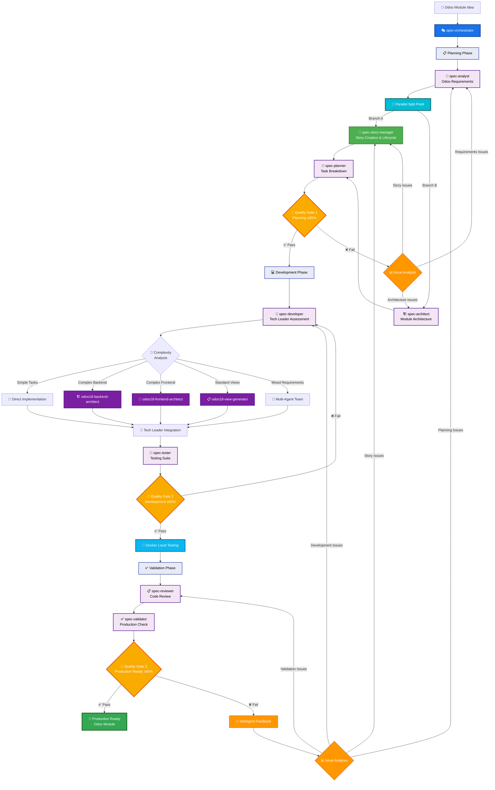

# Claude Sub-Agent Spec Workflow System

> **Language / 語言**: [English](README.md) | [简体中文](README-zh.md) | [繁體中文](README-zht.md)

A comprehensive AI-driven development workflow system built on Claude Code's Sub-Agents feature. This system transforms project ideas into production-ready code through specialized AI agents working in coordinated phases.

## Table of Contents

- [Overview](#overview)
- [System Architecture](#system-architecture)
- [Installation](#installation)
- [Quick Start](#quick-start)
- [Slash Command Usage](#slash-command-usage)
- [How It Works](#how-it-works)
- [Agent Reference](#agent-reference)
- [Usage Examples](#usage-examples)
- [Quality Gates](#quality-gates)
- [Best Practices](#best-practices)
- [Advanced Usage](#advanced-usage)
- [Troubleshooting](#troubleshooting)

## Overview

The Spec Workflow System leverages Claude Code's Sub-Agents capability to create a multi-agent development pipeline. Each agent is a specialized expert that handles specific aspects of the software development lifecycle, from requirements analysis to final validation.

### Key Features

- **Automated Workflow**: Complete development pipeline from idea to production code
- **🐳 Local-First Testing**: Fast Docker-based testing (30-60s) before remote deployment
- **Story-Driven Development**: BMad-Method integration with user story lifecycle management
- **Progress Tracking**: Real-time task completion tracking with 3-level checkbox hierarchy
- **Document Sharding**: Automatic fragmentation of large documents for better AI processing
- **Specialized Expertise**: Each agent focuses on their domain of expertise
- **Quality Gates**: Automated checkpoints ensure quality standards
- **Flexible Integration**: Works with existing specialized agents
- **Comprehensive Documentation**: Every phase produces detailed artifacts

### Benefits

- 10x faster development from concept to code
- **⚡ 10x faster testing**: Local Docker testing vs slow odoo.sh dependency
- **🔒 Reliable testing**: Eliminate connectivity issues and remote dependencies
- Story-driven development with clear acceptance criteria and progress tracking
- Real-time velocity analytics and blocker identification
- Automatic document fragmentation for optimal AI processing and collaboration
- Consistent quality through automated validation
- Comprehensive documentation generated automatically
- Reduced errors through systematic processes
- Better collaboration through clear workflows and checkbox progress visibility
- **🚀 Confident deployments**: Fix issues locally before production deployment

## System Architecture

### Multi-Agent Odoo 18 Development Pipeline



## Installation

### Prerequisites

- Claude Code (latest version)
- Project directory initialized
- Basic understanding of AI-assisted development

### Setup Steps

1. **Download the agents**

   ```bash
   # Option 1: Clone the repository
   git clone https://github.com/zhsama/claude-sub-agent.git
   cd claude-sub-agent
   
   # Option 2: Download specific agents you need
   # Individual agent files are available in the agents/ directory
   ```

2. **Copy agents and slash commands to your project's Claude Code directory**

   ```bash
   # Create .claude directory structure in your project
   mkdir -p ../.claude/agents ../.claude/commands ../.claude/template ../.claude/config ../.claude/hooks ../.claude/docker
   
   # Copy all agents from categorized directories
   cp -r agents/*/*.md ../.claude/agents/
   
   # Copy all slash commands
   cp commands/*.md ../.claude/commands/
   
   # Copy templates directory
   cp -r templates/*.md ../.claude/template/
   
   # Copy hooks (for event-driven automation)
   cp -r hooks/*.sh ../.claude/hooks/
   
   # Copy configuration examples (optional - for Odoo.sh integration)
   cp config/odoo-sh.example.json ../.claude/config/
   
   # Copy Docker testing environment (for fast local Odoo testing)
   cp -r docker/* ../.claude/docker/
   ```

3. **Add RULES to CLAUDE.md**

   ```md
   ## Project Documentation Conventions (Important)

   **Documentation Files:** All new documentation or task files must be saved under the `docs/` folder organized by module and version. For example:

   - **Module Requirements**: Save in `docs/{module_name}/v{version}/requirements.md` (e.g., `docs/ai_chat/v1.0.0/requirements.md`)
   - **Architecture Specs**: Save in `docs/{module_name}/v{version}/architecture.md` (e.g., `docs/ai_chat/v1.0.0/architecture.md`)
   - **API Documentation**: Save in `docs/{module_name}/v{version}/api-spec.md`
   - **User Stories**: Save in `docs/{module_name}/v{version}/user-stories.md`
   - **Migration Guides**: Save in `docs/{module_name}/v{version}/migration-guide.md`
   - **Integration Docs**: Save in `docs/integration/` for cross-module documentation
   - **Global Standards**: Save in `docs/global/` for project-wide standards

   **Document Sharding:** For large documents (>500 lines), use automatic sharding:
   - **Sharded Documents**: Save in `docs/{module_name}/v{version}/{document_name}/` directory
   - **Index File**: Maintain `docs/{module_name}/v{version}/{document_name}.md` as entry point
   - **Section Files**: Individual sections as `01-introduction.md`, `02-architecture.md`, etc.
   - **Navigation**: Include cross-references between sections for easy navigation

   **Story Management:** For BMad-Method story-driven development:
   - **Stories**: Save in `stories/{epic_name}/` directory 
   - **Story Files**: Name as `epic-{N}-story-{N.N}-{title}.md`
   - **Progress Tracking**: Use 3-level checkbox hierarchy (Task → Subtask → Action Items)
   - **Templates**: Use `templates/story-template.md` for consistency

   **Framework-Specific Files:** Follow framework conventions:
   - **Odoo Modules**: Place in `user/{module_name}/` with standard structure
   - **React/Next.js**: Place in `src/` with component-based organization
   - **Backend Services**: Place in appropriate service directories

   > **Important:** Always follow naming conventions and ensure proper internationalization. Use document sharding for optimal AI processing of large files.
   ```

4. **Configure Claude Code Hooks (Recommended)**

   Claude Code Hooks provide event-driven automation for odoo.sh deployment monitoring:

   ```bash
   # Make hooks executable
   chmod +x .claude/hooks/*.sh
   
   # Hooks will automatically activate when:
   # 1. post-git-push-hook.sh - Triggered after git push operations
   # 2. deployment-ready-hook.sh - Triggered when deployment monitoring detects readiness
   ```

   **Hook Benefits:**
   - **Event-driven**: Automatically triggered by git operations
   - **Background monitoring**: Non-blocking deployment progress tracking
   - **Smart testing**: Automatic test execution when deployment is ready
   - **Comprehensive reporting**: Detailed deployment and test reports

5. **Setup Docker Local Testing Environment (Recommended for Odoo Projects)**

   For Odoo development projects, set up fast local testing with Docker:

   ```bash
   # Navigate to Docker directory
   cd .claude/docker
   
   # Quick setup (automated)
   ./scripts/docker-setup.sh
   
   # Or manual setup
   docker-compose up -d
   ```

   **Docker Environment Benefits:**
   - ⚡ **10x Faster**: Test in 30-60 seconds vs 5+ minutes on odoo.sh
   - 🔒 **Reliable**: No connectivity issues or remote dependencies
   - 🎯 **Comprehensive**: Unit, integration, and E2E testing
   - 🚀 **Confident Deployments**: Fix issues locally before odoo.sh

   **Access Services:**
   - **Odoo**: http://localhost:8069 (admin/admin_secure_2024)
   - **pgAdmin**: http://localhost:8080 (with `--profile tools`)
   - **MailHog**: http://localhost:8025 (with `--profile tools`)

   **Quick Testing:**
   ```bash
   # Test AI modules
   ./.claude/docker/scripts/docker-test.sh
   
   # Test specific modules with verbose output
   ./.claude/docker/scripts/docker-test.sh -m ai_chat,ai_config -v
   ```

6. **Configure Odoo.sh Integration (Optional)**

   For secondary validation on odoo.sh after local testing:

   ```bash
   # Copy the example configuration
   cp .claude/config/odoo-sh.example.json .claude/config/odoo-sh.json
   
   # Edit the configuration with your odoo.sh details
   # Update SSH hosts, environments, and module settings
   ```

   **Example configuration:**
   ```json
   {
     "environments": {
       "staging": {
         "ssh_host": "your-user@your-project-stage.dev.odoo.com",
         "ssh_key_path": "~/.ssh/odoo_sh_key",
         "active": true
       }
     },
     "default_environment": "staging",
     "test_settings": {
       "default_modules": ["your_module", "your_other_module"]
     }
   }
   ```

   **Test the configuration:**
   ```bash
   # Test SSH connectivity
   ssh your-user@your-project-stage.dev.odoo.com "echo 'Connection successful'"
   
   # Test odoo.sh commands
   ssh your-user@your-project-stage.dev.odoo.com "odoo-bin --version"
   ```

6. **Verify installation**

   **Repository Structure:**

   ```text
   claude-sub-agent/
   ├── agents/
   │   ├── spec-agents/         # Core workflow agents
   │   │   ├── spec-analyst.md
   │   │   ├── spec-architect.md
   │   │   ├── spec-developer.md
   │   │   ├── spec-orchestrator.md
   │   │   ├── spec-planner.md
   │   │   ├── spec-progress-tracker.md
   │   │   ├── spec-reviewer.md
   │   │   ├── spec-story-manager.md
   │   │   ├── spec-tester.md
   │   │   └── spec-validator.md
   │   ├── backend/             # Backend specialists
   │   │   ├── senior-backend-architect.md
   │   │   ├── odoo18-backend-architect.md
   │   │   └── odoo-sh-tester.md
   │   ├── frontend/            # Frontend specialists
   │   │   ├── senior-frontend-architect.md
   │   │   ├── odoo18-view-generator.md
   │   │   └── odoo18-frontend-architect.md
   │   ├── ui-ux/              # Design specialists
   │   │   └── ui-ux-master.md
   │   └── utility/             # Utility agents
   │       ├── doc-sharding-agent.md
   │       ├── git-push-deploy.md
   │       └── refactor-agent.md
   ├── commands/               # Slash commands
   │   ├── agent-workflow.md
   │   ├── create-story.md
   │   ├── deploy-odoo.md
   │   ├── git-push-deploy.md
   │   ├── shard-document.md
   │   └── track-progress.md
   ├── config/                 # Configuration examples
   │   └── odoo-sh.example.json
   ├── hooks/                  # Claude Code Hooks
   │   ├── post-git-push-hook.sh
   │   └── deployment-ready-hook.sh
   ├── templates/              # Story and document templates
   │   └── story-template.md
   └── CLAUDE.md
   ```

   **Your project structure after installation:**

   ```text
   your-project/
   ├── .claude/
   │   ├── commands/
   │   │   ├── agent-workflow.md   # Main workflow slash command
   │   │   ├── create-story.md     # Story creation command
   │   │   ├── deploy-odoo.md      # Odoo.sh deployment command
   │   │   ├── git-push-deploy.md  # Git push with deployment monitoring
   │   │   ├── shard-document.md   # Document sharding command
   │   │   └── track-progress.md   # Progress tracking command
   │   ├── config/
   │   │   └── odoo-sh.json        # Odoo.sh configuration (optional)
   │   ├── hooks/
   │   │   ├── post-git-push-hook.sh     # Auto deployment monitoring hook
   │   │   └── deployment-ready-hook.sh  # Auto testing trigger hook
   │   ├── templates/
   │   │   └── story-template.md   # User story template
   │   ├── docker/                 # 🐳 Local testing environment
   │   │   ├── docker-compose.yml  # Complete Odoo 18 testing stack
   │   │   ├── config/             # Optimized configurations
   │   │   ├── scripts/            # Setup and testing scripts
   │   │   ├── logs/               # Test reports and logs
   │   │   └── README.md           # Docker usage guide
   │   └── agents/
   │       ├── spec-analyst.md
   │       ├── spec-architect.md
   │       ├── spec-developer.md
   │       ├── spec-orchestrator.md
   │       ├── spec-planner.md
   │       ├── spec-progress-tracker.md
   │       ├── spec-reviewer.md
   │       ├── spec-story-manager.md
   │       ├── spec-tester.md
   │       ├── spec-validator.md
   │       ├── docker-manager.md    # 🐳 Docker environment management
   │       ├── senior-backend-architect.md
   │       ├── odoo18-backend-architect.md
   │       ├── odoo-sh-tester.md
   │       ├── senior-frontend-architect.md
   │       ├── odoo18-view-generator.md
   │       ├── odoo18-frontend-architect.md
   │       ├── ui-ux-master.md
   │       ├── doc-sharding-agent.md
   │       ├── git-push-deploy.md
   │       └── refactor-agent.md
   ├── CLAUDE.md
   └── ... (your project files)
   ```

## Quick Start

### Basic Usage

```bash
# Start a new project workflow
Ask Claude: "Use the spec-orchestrator agent to create a todo list web application"

# The orchestrator will automatically:
# 1. Analyze requirements and create initial user stories
# 2. Create comprehensive user stories with BMad-Method principles
# 3. Design architecture
# 4. Plan tasks with 3-level checkbox tracking
# 5. Implement code with real-time progress monitoring
# 6. 🐳 Test locally in Docker (30-60 seconds)
# 7. Deploy to production with confidence
# 8. Track progress and identify blockers
# 7. Write tests
# 8. Review and validate
```

### Simple Example

```markdown
You: Use spec-orchestrator to create a personal blog platform

Claude (spec-orchestrator): Starting workflow for personal blog platform...

[Planning Phase - 45 minutes]
✓ Requirements analyzed
✓ Architecture designed
✓ Tasks planned
✓ Quality Gate 1: PASSED (96/100)

[Development Phase - 2 hours]
✓ 15 tasks implemented
✓ Tests written
✓ Quality Gate 2: PASSED (88/100)

[Validation Phase - 30 minutes]
✓ Code reviewed
✓ Final validation complete
✓ Quality Gate 3: PASSED (91/100)

Project complete! Generated artifacts:
- requirements.md
- architecture.md
- Source code (15 files)
- Test suites (85% coverage)
- Documentation
```

## Slash Command Usage

For the quickest way to start a complete workflow, use our custom slash command:

### Basic Usage

```bash
/agent-workflow "Create a task management web application with user authentication and real-time updates"
```

### Advanced Usage

```bash
# High-quality enterprise project
/agent-workflow "Develop a CRM system with customer management and analytics" --quality=95

# Quick prototype development  
/agent-workflow "Simple personal blog website" --quality=75 --skip-agent=spec-tester

# From existing requirements
/agent-workflow "Mobile app based on existing requirements" --skip-agent=spec-analyst

# Specific phases only
/agent-workflow "Microservices e-commerce platform" --phase=planning
```

### Command Options

- `--quality=[75-95]`: Set quality gate threshold
- `--skip-agent=[agent-name]`: Skip specific agents
- `--phase=[planning|development|validation|all]`: Run specific phases
- `--output-dir=[path]`: Specify output directory
- `--language=[zh|en]`: Documentation language

**📖 For complete slash command documentation, see:**
- [agent-workflow.md](./commands/agent-workflow.md) - Main workflow orchestration
- [create-story.md](./commands/create-story.md) - Story creation and management
- [deploy-odoo.md](./commands/deploy-odoo.md) - Odoo.sh deployment and testing
- [git-push-deploy.md](./commands/git-push-deploy.md) - Git push with intelligent deployment monitoring
- [track-progress.md](./commands/track-progress.md) - Real-time progress tracking
- [shard-document.md](./commands/shard-document.md) - Document sharding and organization

**🎣 Hook-Based Automation:**
- [post-git-push-hook.sh](./hooks/post-git-push-hook.sh) - Automatic deployment monitoring after git push
- [deployment-ready-hook.sh](./hooks/deployment-ready-hook.sh) - Automatic testing when deployment is ready

## How It Works

### 1. Claude Code Sub-Agents Integration

According to Claude Code's documentation, sub-agents work by:

- Operating in isolated context windows
- Preventing pollution of the main conversation
- Allowing specialized, focused interactions
- Being automatically selected based on task context

Our system leverages these features by creating specialized agents for each development phase.

### 2. Workflow Phases

#### Planning Phase

1. **spec-analyst**: Analyzes requirements and creates initial user stories
2. **spec-story-manager**: Creates comprehensive user stories with BMad-Method lifecycle management
3. **spec-architect**: Designs system architecture
4. **spec-planner**: Breaks down work into tasks with 3-level checkbox tracking
5. **Quality Gate 1**: Validates planning completeness

#### Development Phase (Tech Leader Coordination)

1. **spec-developer**: Serves as Tech Leader, assesses task complexity and coordinates development through intelligent delegation:
   - **Simple Tasks**: Direct implementation
   - **Complex Backend**: Delegates to odoo18-backend-architect
   - **Complex Frontend**: Delegates to odoo18-frontend-architect
   - **Standard Views**: Delegates to odoo18-view-generator
   - **Mixed Requirements**: Coordinates multi-agent team
   - **Integration**: Consolidates specialist outputs into cohesive solution
2. **spec-progress-tracker**: Monitors Tech Leader coordination and specialist utilization
3. **spec-tester**: Writes comprehensive tests for all integrated components
4. **Quality Gate 2**: Validates code quality and Tech Leader coordination effectiveness

#### Validation Phase

1. **spec-reviewer**: Reviews code for best practices
2. **spec-validator**: Final production readiness check
3. **Quality Gate 3**: Ensures deployment readiness

### 3. Agent Communication

Agents communicate through structured artifacts:

- Each agent produces specific documents
- Next agent uses previous outputs as input
- Orchestrator manages the flow
- Quality gates ensure consistency

## Agent Reference

### Agent Classification System

Our agents are organized into specialized categories for better organization and domain expertise:

- **spec-agents/**: Core workflow orchestration agents
- **backend/**: Backend system specialists
- **frontend/**: Frontend development specialists  
- **ui-ux/**: User experience and design specialists
- **utility/**: General-purpose utility agents

### Core Workflow Agents (spec-agents/)

| Agent | Purpose | Inputs | Outputs |
|-------|---------|--------|---------|
| spec-orchestrator | Workflow coordination | Project description | Status reports, routing |
| spec-analyst | Requirements analysis | User description | requirements.md, initial user-stories.md |
| spec-story-manager | Story lifecycle management | Requirements | Comprehensive user stories, acceptance criteria |
| spec-architect | System design | Requirements, Stories | architecture.md, api-spec.md |
| spec-planner | Task planning with checkboxes | Architecture, Stories | tasks.md with 3-level checkboxes, test-plan.md |
| spec-developer | **Tech Leader & Implementation Coordinator** | Tasks, Stories | **Task complexity assessment, agent delegation, integrated implementation** |
| spec-progress-tracker | Progress monitoring | Task status | Progress reports, velocity metrics, blocker alerts |
| spec-tester | Testing | Code | Test suites, coverage reports |
| spec-reviewer | Code review | Code | Review report, improvements |
| spec-validator | Final validation | All artifacts | Validation report, quality score |

### Specialist Agents by Category

#### Backend Specialists (backend/)

| Agent | Domain | Integration Point |
|-------|--------|-----------|
| senior-backend-architect | Backend Systems & Architecture | Architecture/Development phase |
| **odoo18-backend-architect** | **Odoo 18 Backend Development** | **Delegated by spec-developer Tech Leader** |

#### Frontend Specialists (frontend/)

| Agent | Domain | Integration Point |
|-------|--------|-----------|
| senior-frontend-architect | Frontend Systems & Architecture | Development phase |
| **odoo18-view-generator** | **Odoo 18 XML View Generation** | **Delegated by spec-developer Tech Leader** |
| **odoo18-frontend-architect** | **Odoo 18 OWL Frontend Development** | **Delegated by spec-developer Tech Leader** |

#### UI/UX Specialists (ui-ux/)

| Agent | Domain | Integration Point |
|-------|--------|-----------|
| ui-ux-master | User Experience & Interface Design | Planning/Development phase |

#### Utility Agents (utility/)

| Agent | Domain | Integration Point |
|-------|--------|-----------|
| doc-sharding-agent | Document Fragmentation & Management | Post-analysis, Post-architecture, Final organization |
| git-push-deploy | Git Push with Deployment Monitoring | Post-development, CI/CD integration |
| refactor-agent | Code Quality & Refactoring | Any phase |

## Usage Examples

### Example 1: Enterprise Application

```bash
# High-quality enterprise system
Use spec-orchestrator with quality threshold 95:
Create an enterprise CRM system with:
- Multi-tenancy support
- Role-based access control
- RESTful API
- Real-time dashboard
- Audit logging
```

### Example 2: Quick Prototype

```bash
# Fast prototype with lower quality threshold
Use spec-orchestrator with quality threshold 75 and skip analyst:
Create a simple landing page with email capture
```

### Example 3: Existing Requirements

```bash
# Start from existing documentation
Use spec-orchestrator starting from requirements:
Load requirements from ./docs/requirements.md and continue workflow
```

### Example 4: Specific Phase Only

```bash
# Run only validation on existing code
Use spec-orchestrator for validation phase only:
Validate the project in ./my-app/
```

### Example 5: Odoo.sh CI/CD Integration

```bash
# Deploy Odoo modules to staging environment
/deploy-odoo staging --modules=ai_chat,ai_config --test-suite=comprehensive

# Quick deployment with minimal testing
/deploy-odoo --test-suite=quick

# Health check only (no deployment)
/deploy-odoo --test-suite=health-only

# Use odoo-sh-tester directly
Use odoo-sh-tester: Run comprehensive test suite for AI modules
Use odoo-sh-tester: Check odoo.sh environment health and recent logs
Use odoo-sh-tester: Open interactive Odoo shell for debugging
```

### Example 6: Document Sharding

```bash
# Automatic document sharding during workflow
# Large documents (>500 lines) are automatically sharded during the workflow

# Manual document sharding
/shard-document requirements.md --threshold=400 --output=docs/sharded/

# Shard multiple documents with batch processing
/shard-document docs/ --pattern="*.md" --threshold=300 --dry-run

# Use doc-sharding-agent directly
Use doc-sharding-agent: Shard the architecture.md document for better AI processing
```

### Example 7: Git Push with Deployment Monitoring

```bash
# Intelligent Git push with automated odoo.sh deployment monitoring
/git-push-deploy --message="Implement AI chat improvements" --test-suite=comprehensive

# Quick deployment with minimal testing
/git-push-deploy --test-suite=quick --timeout=300

# Emergency deployment with health-check only
/git-push-deploy --message="Hotfix: Critical security update" --test-suite=health-only

# Multi-branch deployment
/git-push-deploy --branch="staging" --strategy=polling --modules="ai_chat,ai_config"

# Use git-push-deploy agent directly
Use git-push-deploy: Push current changes and monitor odoo.sh deployment with comprehensive testing
Use git-push-deploy: Emergency deployment with message "Fix critical bug" and health-check-only testing
Use git-push-deploy: Push to staging branch with polling strategy and 10-minute timeout
```

### Example 8: Hook-Based Event-Driven Automation

```bash
# Hooks automatically activate on git operations:

# 1. Developer pushes code
git push origin v18-dev25

# 2. post-git-push-hook.sh automatically:
#    - Detects Odoo-related changes
#    - Starts background deployment monitoring
#    - Tracks SSH connectivity and service status
#    - Creates deployment-ready trigger when complete

# 3. deployment-ready-hook.sh automatically:
#    - Executes comprehensive test suite
#    - Generates detailed test reports
#    - Provides success/failure notifications
#    - Creates actionable next steps

# Manual hook monitoring:
tail -f .claude/config/deployment-hooks.log

# Hook status and control:
# View active monitoring processes
ps aux | grep deployment-monitor

# Stop deployment monitoring if needed
kill $(cat .claude/config/deployment-monitor.pid)
```

## Quality Gates

### Gate 1: Planning Quality (95% threshold)

- Requirements completeness
- Architecture feasibility
- Task breakdown quality
- User story clarity

### Gate 2: Development Quality (80% threshold)

- Test coverage
- Code quality metrics
- Security scan results
- Performance benchmarks

### Gate 3: Production Readiness (85% threshold)

- Overall quality score
- Documentation completeness
- Deployment readiness
- Operational requirements

## Best Practices

### 1. Project Preparation

- Write clear project descriptions
- Include constraints and requirements
- Specify quality expectations
- Provide existing documentation

### 2. Working with Agents

- Let each agent complete their phase
- Review artifacts between phases
- Use feedback loops effectively
- Trust the quality gates

### 3. Customization

- Adjust quality thresholds based on needs
- Skip agents for simpler projects
- Add custom validation criteria
- Integrate with existing workflows

### 4. Performance Optimization

- Enable parallel execution for large projects
- Cache results for iterative development
- Use phase-specific execution
- Monitor resource usage

## Advanced Usage

### Custom Workflows

```python
# Create custom workflow configuration
workflow_config = {
    "quality_threshold": 90,
    "skip_agents": ["spec-analyst"],  # If you have requirements
    "parallel": True,
    "custom_validators": ["security-scan", "performance-test"],
    "output_format": "markdown"
}

# Execute with custom config
"Use spec-orchestrator with config: " + json.dumps(workflow_config)
```

### Integration with CI/CD

```yaml
# GitHub Actions example
name: AI Workflow Validation
on: [pull_request]
jobs:
  validate:
    runs-on: ubuntu-latest
    steps:
      - uses: actions/checkout@v3
      - name: Run Spec Validation
        run: |
          # Use Claude Code CLI (if available)
          claude-code run spec-orchestrator \
            --phase validation \
            --project-path .
```

### Extending the System

1. **Add New Agents**
   - Create agent with YAML frontmatter
   - Define clear responsibilities
   - Specify input/output formats
   - Update orchestrator routing

2. **Custom Quality Gates**
   - Define new criteria
   - Set appropriate thresholds
   - Implement validation logic
   - Add to workflow

3. **Domain-Specific Workflows**
   - Create specialized orchestrators
   - Define domain patterns
   - Customize quality criteria
   - Optimize for specific needs

## Troubleshooting

### Common Issues

1. **Agent Not Found**
   - Verify agents are in correct directory
   - Check YAML frontmatter format
   - Ensure proper file permissions

2. **Quality Gate Failures**
   - Review specific criteria that failed
   - Check artifact completeness
   - Allow agents to revise work
   - Consider adjusting thresholds

3. **Workflow Stuck**
   - Check orchestrator status
   - Review last agent output
   - Look for error messages
   - Restart from last checkpoint

### Debug Mode

```bash
# Enable verbose logging
Use spec-orchestrator with debug mode:
Create test project and show all agent interactions
```

## Contributing

We welcome contributions! Please:

1. Follow the existing agent format
2. Add comprehensive documentation
3. Include usage examples
4. Test with the orchestrator
5. Submit PR with description

## License

MIT License - see LICENSE file for details

## Acknowledgments

- Built on Claude Code's Sub-Agents feature
- Inspired by BMAD methodology
- Community contributions welcome

---

For more information, see:

- [Claude Code Documentation](https://docs.anthropic.com/en/docs/claude-code)
- [Sub-Agents Guide](https://docs.anthropic.com/en/docs/claude-code/sub-agents)
- [Project Issues](https://github.com/zhsama/claude-sub-agent/issues)
