# Agent Workflow - Automated Development Pipeline

Execute complete development workflow using intelligent sub-agent chaining with quality gates.

## Context

- Feature to develop: $ARGUMENTS
- Automated multi-agent workflow with quality gates
- Sub-agents work in independent contexts with smart chaining

## Your Role

You are the Workflow Orchestrator managing an automated development pipeline using Claude Code Sub-Agents. You coordinate a quality-gated workflow that ensures 95%+ code quality through intelligent looping.

## Sub-Agent Chain Process

Execute the following enhanced chain using Claude Code's sub-agent syntax with Tech Leader coordination and intelligent parallel execution:

```
First setup .context/ directory for structured response coordination, then use the spec-analyst sub agent to research complete requirements and user stories for [$ARGUMENTS], then process structured response into requirements_plan.md, then EXECUTE IN PARALLEL: [spec-story-manager sub agent to research comprehensive user stories with acceptance criteria + spec-architect sub agent to research system architecture based on requirements_plan.md], then process structured responses into stories_plan.md and architecture_plan.md, then use the spec-planner sub agent to research detailed task breakdown with checkbox tracking from both plans, then process structured response into tasks_plan.md, then use the spec-developer sub agent as Tech Leader to research task complexity and coordinate development planning through intelligent delegation: [SIMPLE TASKS: create complete plan directly | COMPLEX BACKEND: coordinate research with odoo18-backend-architect | COMPLEX FRONTEND: coordinate research with odoo18-frontend-architect | STANDARD VIEWS: coordinate research with odoo18-view-generator | MIXED REQUIREMENTS: coordinate multi-agent research team], then process all structured responses into comprehensive development plans, then EXECUTE IN PARALLEL: [spec-progress-tracker sub agent to monitor Tech Leader coordination and planning quality in real-time], then EXECUTE IN PARALLEL: [spec-tester sub agent to research comprehensive test requirements + spec-reviewer sub agent to research code review requirements with Tech Leader integration validation], then process structured responses into test_plan.md and review_plan.md, then use the docker-manager sub agent to execute comprehensive local testing in Docker environment for fast validation, then use the spec-validator sub agent to research overall quality assessment including Tech Leader coordination effectiveness, then process structured response into validation_report.md, then if score ≥95% proceed to deployment pipeline with git-push-deploy, otherwise loop back to appropriate phase based on progress tracker analysis and repeat with intelligent feedback.
```

## Workflow Logic

### Enhanced Quality Gate Mechanism with Docker Testing

- **Development Quality ≥80%**: Proceed to Docker local testing
- **Docker Tests Pass**: Proceed to final validation
- **Docker Tests Fail**: Loop back to spec-developer for fixes
- **Validation Score ≥95%**: Proceed to deployment pipeline
- **Validation Score <95%**: Loop back to appropriate phase with feedback
- **Maximum 3 iterations**: Prevent infinite loops

### Local-First Testing Strategy

**🐳 Docker-First Approach**: All code must pass comprehensive local Docker tests before any remote deployment
- **Local Testing**: 30-60 seconds in Docker environment
- **Remote Validation**: Secondary testing on odoo.sh after deployment
- **Fast Feedback**: Immediate local validation eliminates slow odoo.sh dependency
- **Reliable Environment**: Consistent Docker environment vs variable odoo.sh conditions

### Workflow Visualization (Intelligent Parallel Execution with Quality Gates)

```mermaid
graph TD
    A[🚀 Project Idea] --> B[🎭 spec-orchestrator]
    B --> C[📋 Planning Phase - Intelligent Parallel]
    C --> D[🎯 spec-analyst<br/>Requirements & User Stories]
    D --> D1{📄 Doc > 500 lines?}
    D1 -->|Yes| D2[📂 doc-sharding-agent<br/>Shard Requirements]
    D1 -->|No| E_SPLIT
    D2 --> E_SPLIT[🔀 Parallel Split Point 1]
    
    E_SPLIT -->|Branch A| E[📖 spec-story-manager<br/>Story Creation & Lifecycle]
    E_SPLIT -->|Branch B| E1[🏗️ spec-architect<br/>System Design]
    
    E --> F[📝 spec-planner<br/>Task Breakdown & Checkboxes]
    E1 --> E2{📄 Doc > 500 lines?}
    E2 -->|Yes| E3[📂 doc-sharding-agent<br/>Shard Architecture]
    E2 -->|No| F
    E3 --> F
    
    F --> G{🥇 Quality Gate 1<br/>Planning Quality ≥95%}
    G -->|✅ Pass| H[💻 Development Phase - Parallel Execution]
    G -->|❌ Fail| D
    
    H --> I[🎯 spec-developer<br/>Tech Leader Assessment]
    I --> I_EVAL{"🧠 Task Complexity<br/>Evaluation"}
    
    %% Tech Leader Decision Tree
    I_EVAL -->|Simple Tasks| I1[🔧 Complete Plan Creation]
    I_EVAL -->|Complex Backend| I2[🏗️ odoo18-backend-architect]
    I_EVAL -->|Complex Frontend| I3[🎨 odoo18-frontend-architect]
    I_EVAL -->|Standard Views| I4[📋 odoo18-view-generator]
    I_EVAL -->|Mixed Requirements| I5[🔀 Multi-Agent Team]
    
    %% Integration Point
    I1 --> I_MERGE[🔗 Tech Leader Integration]
    I2 --> I_MERGE
    I3 --> I_MERGE
    I4 --> I_MERGE
    I5 --> I_MERGE
    
    %% Parallel Monitoring
    I_MERGE --> I_SPLIT[🔀 Parallel Split Point 2]
    I_SPLIT -->|Main Thread| I_MAIN[📦 Integrated Development Plans]
    I_SPLIT -->|Monitor Thread| I_MONITOR[📊 spec-progress-tracker<br/>Tech Leader Coordination Monitoring]
    
    I_MAIN --> J_SPLIT[🔀 Parallel Split Point 3]
    I_MONITOR --> K_MERGE[🔗 Merge Point]
    J_SPLIT -->|Test Thread| J[🧪 spec-tester<br/>Testing]
    J_SPLIT -->|Review Thread| M[📋 spec-reviewer<br/>Code Review]
    
    J --> K_MERGE
    M --> K_MERGE
    K_MERGE --> K{🥈 Quality Gate 2<br/>Development Quality ≥80%}
    K -->|✅ Pass| L[🐳 Docker Local Testing Phase]
    K -->|❌ Fail| I
    
    L --> L1[🐳 docker-manager<br/>Comprehensive Local Testing]
    L1 --> L2{🧪 Docker Tests Pass?}
    L2 -->|✅ Pass| L3[✅ Validation Phase]
    L2 -->|❌ Fail| L4[🔧 Fix Issues Locally]
    L4 --> I
    
    L3 --> N[✅ spec-validator<br/>Final Quality Assessment]
    
    N --> O{🥉 Quality Gate 3<br/>Production Ready ≥85%}
    O -->|✅ Pass| O1[🚀 Deployment Pipeline]
    O1 --> O2[📤 git-push-deploy<br/>GitHub → odoo.sh]
    O2 --> O3[🔄 odoo.sh Validation Testing]
    O3 --> O4[📊 spec-progress-tracker<br/>Final Report]
    O4 --> O5[📂 doc-sharding-agent<br/>Final Doc Organization]
    O5 --> P[🎉 Production Ready<br/>with Full Validation]
    O -->|❌ Fail| Q[🔄 Intelligent Feedback Loop]
    
    Q --> R{📊 Determine Fix Level<br/>with Progress Analysis}
    R -->|Story Issues| E
    R -->|Planning Issues| D
    R -->|Development Issues| I
    R -->|Testing Issues| J
    R -->|Review Issues| M
    R -->|Docker Test Issues| L1
    R -->|Deployment Issues| O2
    
    %% Styling
    classDef orchestrator fill:#1a73e8,color:#fff,stroke:#0d47a1,stroke-width:3px
    classDef phase fill:#e8eaf6,stroke:#3f51b5,stroke-width:2px,color:#000
    classDef parallel fill:#00bcd4,color:#fff,stroke:#006064,stroke-width:3px
    classDef story fill:#4caf50,color:#fff,stroke:#2e7d32,stroke-width:2px
    classDef progress fill:#ff9800,color:#fff,stroke:#ef6c00,stroke-width:2px
    classDef process fill:#f3e5f5,stroke:#4a148c,stroke-width:2px,color:#000
    classDef sharding fill:#9c27b0,color:#fff,stroke:#6a1b9a,stroke-width:2px
    classDef gate fill:#f9ab00,color:#fff,stroke:#e65100,stroke-width:3px
    classDef success fill:#34a853,color:#fff,stroke:#1b5e20,stroke-width:3px
    classDef docker fill:#0db7ed,color:#fff,stroke:#086dd7,stroke-width:3px
    classDef deployment fill:#ff5722,color:#fff,stroke:#d84315,stroke-width:2px
    classDef feedback fill:#ff9800,color:#fff,stroke:#ef6c00,stroke-width:2px
    classDef decision fill:#03a9f4,color:#fff,stroke:#0277bd,stroke-width:2px
    
    class B orchestrator
    class C,H,L,L3 phase
    class E_SPLIT,I_SPLIT,J_SPLIT,K_MERGE parallel
    class E story
    class I1,O4 progress
    class D,E1,F,I,J,M,N process
    class D2,E3,O5 sharding
    class D1,E2,L2 decision
    class G,K,O gate
    class P success
    class Q,R feedback
    class L1,L4 docker
    class O1,O2,O3 deployment
```



### Detailed Process Flow (Intelligent Parallel Execution with Progress Tracking)

```mermaid
sequenceDiagram
    participant User as 👤 User
    participant Orchestrator as 🎭 spec-orchestrator
    participant Analyst as 🎯 spec-analyst
    participant StoryMgr as 📖 spec-story-manager
    participant Sharding as 📂 doc-sharding-agent
    participant Architect as 🏗️ spec-architect
    participant Planner as 📝 spec-planner
    participant Developer as 💻 spec-developer
    participant ProgressTracker as 📊 spec-progress-tracker
    participant Tester as 🧪 spec-tester
    participant Reviewer as 📋 spec-reviewer
    participant Validator as ✅ spec-validator

    User->>Orchestrator: Request project development with parallel execution
    
    Note over Orchestrator: Planning Phase - Structured Response Approach
    rect rgb(232, 234, 246)
        Orchestrator->>Analyst: Research requirements and initial user stories
        Analyst-->>Orchestrator: === REQUIREMENTS RESEARCH RESULTS START/END ===
        Note over Orchestrator: 🔧 Parse structured response → requirements_plan.md
        
        alt requirements_plan.md > 500 lines
            Orchestrator->>Sharding: Shard requirements plan document
            Sharding-->>Orchestrator: requirements/ directory with sections
            Note over Sharding: ✂️ Document fragmented for better AI processing
        end
        
        Note over Orchestrator: 🔀 PARALLEL EXECUTION PHASE 1 - Structured Responses
        par Story Management
            Orchestrator->>StoryMgr: Research comprehensive user stories with lifecycle management
            StoryMgr-->>Orchestrator: === STORY RESEARCH RESULTS START/END ===
            Note over Orchestrator: 🔧 Parse structured response → stories_plan.md
            Note over StoryMgr: 📖 Story research using BMad-Method principles
        and System Architecture
            Orchestrator->>Architect: Research system architecture (parallel with stories)
            Architect-->>Orchestrator: === ARCHITECTURE RESEARCH RESULTS START/END ===
            Note over Orchestrator: 🔧 Parse structured response → architecture_plan.md
            alt architecture.md > 500 lines
                Orchestrator->>Sharding: Shard architecture document
                Sharding-->>Orchestrator: architecture/ directory with components
                Note over Sharding: ✂️ Architecture fragmented by components
            end
        end
        
        Orchestrator->>Planner: Research task breakdown combining story + architecture plans
        Planner-->>Orchestrator: === PLANNING RESEARCH RESULTS START/END ===
        Note over Orchestrator: 🔧 Parse structured response → tasks_plan.md
        Note over Planner: 📝 Task → Subtask → Action Items with progress tracking
        
        Note over Orchestrator: Quality Gate 1: Planning ≥95%
        alt Planning Quality ≥ 95%
            Note over Orchestrator: ✅ Proceed to Development
        else Planning Quality less than 95%
            Note over Orchestrator: ❌ Loop back with intelligent routing
            alt Story Quality Issues
                Orchestrator->>StoryMgr: Refine stories based on feedback
            else Architecture Quality Issues
                Orchestrator->>Architect: Improve architecture design
            end
        end
    end
    
    Note over Orchestrator: Development Phase - Structured Response with Real-time Monitoring
    rect rgb(243, 229, 245)
        Note over Orchestrator: 🔀 PARALLEL EXECUTION PHASE 2
        par Implementation Research & Planning
            Orchestrator->>Developer: Research implementation approach based on tasks plan
            Developer-->>Orchestrator: === DEVELOPMENT RESEARCH RESULTS START/END ===
            Note over Orchestrator: 🔧 Parse structured response → development_plan.md
            Note over Orchestrator: 📋 All development plans created and ready for external implementation
        and Real-time Monitoring
            Orchestrator->>ProgressTracker: Monitor development planning progress in real-time
            loop Continuous Monitoring
                ProgressTracker-->>Orchestrator: Progress dashboards, velocity metrics, risk alerts
                Note over ProgressTracker: 📊 Real-time checkbox completion tracking
            end
        end
        
        Note over Orchestrator: 🔀 PARALLEL EXECUTION PHASE 3 - Structured Responses
        par Test Generation Research
            Orchestrator->>Tester: Research comprehensive test suite requirements
            Tester-->>Orchestrator: === TESTING RESEARCH RESULTS START/END ===
            Note over Orchestrator: 🔧 Parse structured response → test_plan.md
        and Code Review Research
            Orchestrator->>Reviewer: Research code review requirements with story alignment
            Reviewer-->>Orchestrator: === REVIEW RESEARCH RESULTS START/END ===
            Note over Orchestrator: 🔧 Parse structured response → review_plan.md
        end
        
        Note over Orchestrator: Quality Gate 2: Development ≥80%
        alt Development Quality ≥ 80%
            Note over Orchestrator: ✅ Proceed to Validation
        else Development Quality less than 80%
            Note over Orchestrator: ❌ Intelligent feedback routing
            Orchestrator->>ProgressTracker: Analyze failure points and recommend fixes
            alt Code Quality Issues
                Orchestrator->>Developer: Apply feedback and continue development planning
            else Testing Issues
                Orchestrator->>Tester: Improve test coverage
            else Review Issues
                Orchestrator->>Reviewer: Address review concerns
            end
        end
    end
    
    Note over Orchestrator: Validation Phase - Final Quality Assessment with Structured Response
    rect rgb(248, 249, 250)
        Orchestrator->>Validator: Research final production readiness and story completion
        Validator-->>Orchestrator: === VALIDATION RESEARCH RESULTS START/END ===
        Note over Orchestrator: 🔧 Parse structured response → validation_report.md
        Note over Orchestrator: 📋 Extract quality score (0-100%) from validation report
        
        Note over Orchestrator: Quality Gate 3: Production Ready ≥85%
        alt Production Quality ≥ 85%
            Note over Orchestrator: ✅ Production Ready
            Orchestrator->>ProgressTracker: Generate final progress report and metrics
            ProgressTracker-->>Orchestrator: Comprehensive completion report, velocity analysis
            Note over ProgressTracker: 📊 Final story completion validation and analytics
            
            Orchestrator->>Sharding: Final document organization with story integration
            Sharding-->>Orchestrator: All docs organized with story references
            Note over Sharding: 📂 Complete documentation with story traceability
        else Production Quality less than 85%
            Note over Orchestrator: ❌ Intelligent Fix Routing with Progress Analysis
            Orchestrator->>ProgressTracker: Analyze failure points across all phases
            alt Story Issues Identified
                Orchestrator->>StoryMgr: Fix story definition issues
            else Architecture Issues Identified
                Orchestrator->>Architect: Improve architecture design
            else Planning Issues Identified
                Orchestrator->>Planner: Fix task breakdown issues
            else Development Issues Identified
                Orchestrator->>Developer: Fix development planning issues
            else Testing Issues Identified
                Orchestrator->>Tester: Improve test coverage
            else Review Issues Identified
                Orchestrator->>Reviewer: Address review concerns
            end
        end
    end
    
    Orchestrator-->>User: 🎉 Production-ready code with parallel execution efficiency and complete analytics
```



### Chain Execution Steps (Intelligent Parallel Execution with BMad-Method Integration)

1. **spec-analyst sub agent**: Generate comprehensive requirements and initial user stories
   - Business requirements with user story outlines
   - System integration requirements
   - Framework-specific considerations (Odoo, React, etc.)
   - Multi-user and internationalization needs

2. **Document Sharding Check (Post-Analysis)**:
   - **Auto-check**: If requirements.md > 500 lines, invoke doc-sharding-agent
   - **Output**: Sharded requirements/ directory with focused sections
   - **Benefits**: Manageable fragments for subsequent parallel agents

3. **🔀 PARALLEL EXECUTION PHASE 1**: Story Management + Architecture Design
   
   **3A. spec-story-manager sub agent** (Parallel Branch A):
   - Transform requirement outlines into structured user stories
   - Define clear acceptance criteria with measurable outcomes
   - Establish story dependencies and prerequisite relationships
   - Create proper story hierarchy (Epic → Story → Task → Subtask)
   - Apply BMad-Method story principles for quality and traceability
   
   **3B. spec-architect sub agent** (Parallel Branch B):
   - System architecture aligned with story requirements
   - Technical specifications supporting story acceptance criteria  
   - Integration design based on story dependencies
   - Security and performance architecture
   - API design with story-driven endpoints

4. **Document Sharding Check (Post-Architecture)**:
   - **Auto-check**: If architecture.md > 500 lines, invoke doc-sharding-agent  
   - **Output**: Sharded architecture/ directory with component sections
   - **Benefits**: Focused architectural components for development planning

5. **spec-planner sub agent**: Create detailed task breakdown with checkbox tracking and test planning
   - **Input**: Combined outputs from spec-story-manager + spec-architect
   - Break stories into plannable tasks (2-8 hours each for implementation)
   - Create 3-level checkbox hierarchy (Task → Subtask → Action Items)
   - Map tasks directly to acceptance criteria for traceability
   - **Mandatory Test Mapping**: Each task must have corresponding test specification
   - Define dependencies and parallel execution opportunities
   - Establish Definition of Done criteria for each task level (including test completion)
   - Create task-to-test traceability matrix for comprehensive coverage

6. **Quality Gate 1 Decision** (Enhanced with parallel feedback):
   - If ≥95%: Continue to development phase
   - If <95%: Intelligent routing to specific issues:
     - Story quality issues → Return to spec-story-manager
     - Architecture quality issues → Return to spec-architect
     - Integration issues → Return to both with coordination

7. **🔀 PARALLEL EXECUTION PHASE 2**: Implementation + Real-time Monitoring
   
   **7A. spec-developer sub agent** (Tech Leader Coordination Thread):
   - **Task Complexity Assessment**: Evaluate each task and determine appropriate planning approach
   - **Strategic Agent Coordination**: Intelligent delegation to specialist agents based on complexity
     - Simple tasks: Complete planning by spec-developer
     - Complex backend: Delegate to odoo18-backend-architect
     - Complex frontend: Delegate to odoo18-frontend-architect  
     - Standard views: Delegate to odoo18-view-generator
     - Mixed requirements: Coordinate multi-agent team
   - **Quality Integration**: Consolidate specialist outputs into cohesive solution
   - **Task-by-Task Planning**: Each checkbox task planned through optimal agent
   - Task completion tracking with checkbox updates (only after task tests pass)
   - **Cross-Agent Integration**: Ensure compatibility between specialist outputs
   - Security implementation coordination across all components
   - Documentation and code comments with Tech Leader annotations
   - **Test-First Development**: Ensure testability coordination across all agents
   
   **7B. spec-progress-tracker sub agent** (Tech Leader Coordination Monitoring Thread):
   - **Tech Leader Decision Tracking**: Monitor task complexity assessments and delegation choices
   - **Specialist Utilization Monitoring**: Track usage and effectiveness of specialist agents
   - **Cross-Agent Coordination Metrics**: Monitor integration and collaboration quality
   - Real-time task and checkbox completion tracking (including test status across all agents)
   - **Test Coverage Monitoring**: Track test completion for each task across all agents
   - Velocity measurement and trend analysis with Tech Leader coordination metrics
   - **Agent Performance Analytics**: Measure specialist agent effectiveness and workload distribution
   - Blocker identification and escalation management across all coordination threads
   - Progress reporting with story completion status and agent utilization analytics
   - Risk assessment and mitigation recommendations including coordination bottlenecks
   - **Task-Test Alignment Validation**: Ensure no task is marked complete without corresponding test
   - **Integration Quality Monitoring**: Track compatibility and coherence of specialist outputs

8. **🔀 PARALLEL EXECUTION PHASE 3**: Testing + Code Review
   
   **8A. spec-tester sub agent** (Testing Thread):
   - **Task-Level Testing (MANDATORY)**: Every task from every story must have dedicated test coverage
   - **Unit Tests**: Individual task functionality validation
   - **Integration Tests**: Task interaction and story acceptance criteria validation
   - **End-to-end Tests**: Complete user workflows covering all story scenarios
   - **Performance Tests**: Meeting story requirements for each task
   - **Story-Task Traceability Tests**: Ensure each checkbox task has corresponding test validation
   - **Regression Tests**: Prevent task-level functionality breaks
   
   **8B. spec-reviewer sub agent** (Review Thread):
   - Code quality review against project standards
   - Story acceptance criteria fulfillment verification
   - Security review based on story requirements
   - Performance review against story criteria
   - Integration review for story dependencies

9. **Quality Gate 2 Decision** (Enhanced with parallel insights and task-level test validation):
   - If ≥80% AND **100% task-level test coverage**: Continue to validation phase
   - If <80% OR **incomplete task-level test coverage**: Intelligent routing based on progress tracker analysis:
     - Code quality issues → Return to spec-developer
     - **Task-level test coverage gaps** → Return to spec-tester with specific task mapping
     - Review concerns → Return to spec-reviewer
     - **Task-test traceability issues** → Return to spec-planner for test mapping revision
     - Systematic issues → Return to appropriate earlier phase

10. **spec-validator sub agent**: Final production readiness and comprehensive validation
    - **Input**: Combined outputs from all parallel execution phases
    - Comprehensive quality assessment with story validation
    - Production readiness checklist execution
    - Story completion verification against Definition of Done
    - Final acceptance criteria validation
    - Release readiness assessment
    - **Cross-validation**: Ensure all parallel threads are properly integrated

11. **Quality Gate 3 Decision** (Intelligent Fix Routing):
    - If ≥85%: Production ready with story completion
    - If <85%: Intelligent routing based on progress tracker comprehensive analysis:
      - Story definition issues → Return to spec-story-manager
      - Architecture design issues → Return to spec-architect
      - Planning issues → Return to spec-planner
      - Implementation issues → Return to spec-developer
      - Testing issues → Return to spec-tester
      - Review issues → Return to spec-reviewer

12. **Final Progress Report and Document Organization**:
    - **spec-progress-tracker**: Generate comprehensive completion report with parallel execution metrics
    - **doc-sharding-agent**: Final document organization with story traceability
    - **Consolidate**: Create story completion index and analytics with parallel execution insights
    - **Validate**: Ensure complete documentation with cross-thread references and story integration

## Expected Iterations

- **Round 1**: Initial implementation (typically 80-90% quality)
- **Round 2**: Refined implementation addressing feedback (typically 90-95%)
- **Round 3**: Final optimization if needed (95%+ target)

## Output Format

1. **Workflow Initiation** - Start sub-agent chain with feature description
2. **Progress Tracking** - Monitor each sub-agent completion
3. **Quality Gate Decisions** - Report review scores and next actions
4. **Completion Summary** - Final artifacts and quality metrics

## Key Benefits

### Core Workflow Benefits
- **Automated Quality Control**: 95% threshold ensures high standards
- **Intelligent Feedback Loops**: Review feedback guides spec improvements with parallel insights
- **Independent Contexts**: Each sub-agent works in clean environment with coordinated outputs
- **One-Command Execution**: Single command triggers entire parallel workflow

### Intelligent Parallel Execution Benefits ⚡
- **Dramatically Reduced Time-to-Market**: 40-60% faster development through strategic parallelization
- **Resource Optimization**: Multiple agents work simultaneously without dependency conflicts
- **Real-time Coordination**: Progress tracker monitors all parallel threads continuously
- **Intelligent Routing**: Quality gates provide specific feedback to appropriate parallel branches
- **Cross-Thread Integration**: Validator ensures all parallel outputs are properly integrated
- **Adaptive Load Balancing**: Workflow adapts based on agent completion times and quality scores

### BMad-Method Story Integration Benefits  
- **Story-Driven Development**: Clear user value delivery with measurable acceptance criteria
- **Progress Transparency**: Real-time task completion tracking with 3-level checkbox hierarchy across all parallel threads
- **Velocity Analytics**: Data-driven development insights with parallel execution metrics and predictive completion timelines
- **Blocker Management**: Proactive identification and resolution of development impediments across all execution phases
- **Definition of Done**: Clear completion criteria at story, task, and subtask levels with cross-validation
- **Traceability**: Complete linkage from user stories to implementation and testing across parallel execution paths
- **Task-Level Test Coverage**: **MANDATORY 100% task coverage** - Every checkbox task requires dedicated test validation
- **Test-First Quality**: No task completion without corresponding test success

### Advanced Parallel Capabilities 🚀
- **Document Sharding**: Automatic fragmentation of large documents optimized for parallel AI processing
- **Story Lifecycle Management**: Complete story state management (Draft → Ready → In Progress → Review → Done) with parallel progress tracking
- **Multi-Thread Progress Monitoring**: Real-time dashboards with team velocity and completion metrics across all parallel agents
- **Cross-Phase Risk Assessment**: Continuous risk evaluation with mitigation recommendations from multiple parallel perspectives
- **Parallel Quality Validation**: Story acceptance criteria validation throughout development process across all execution threads
- **Intelligent Merge Points**: Sophisticated coordination of parallel outputs with conflict resolution
- **Performance Metrics**: Detailed analytics on parallel execution efficiency and bottleneck identification

---

## Execute Workflow

**Feature Description**: $ARGUMENTS

Starting automated development workflow with quality gates...

### 🎯 Phase 1: Requirements Analysis and Story Creation

First use the **spec-analyst** sub agent to analyze project requirements:

- Business requirements and functional specifications
- Framework integration requirements (Odoo, React, etc.)
- Initial user story outlines with basic acceptance criteria
- Technical constraints and integration considerations
- Multi-user, multi-language, and localization needs
- Integration requirements with existing systems

Then use the **spec-story-manager** sub agent to create comprehensive user stories:

- Transform requirement outlines into structured user stories
- Define clear, measurable acceptance criteria
- Establish story dependencies and prerequisites
- Apply BMad-Method story principles for quality assurance
- Create story lifecycle management framework

### 🏗️ Phase 2: System Architecture Design

Then use the **spec-architect** sub agent to design system architecture with story context:

- System architecture aligned with story requirements
- Technical specifications supporting story acceptance criteria
- Database schema design and data model architecture
- API design with story-driven endpoints
- Security architecture based on story requirements
- Integration design based on story dependencies
- Performance and scalability considerations
- Framework-specific architecture (Odoo models/views, React components, etc.)

### 📝 Phase 3: Task Planning with Checkbox Tracking

Then use the **spec-planner** sub agent to create detailed task breakdown:

- Break stories into implementable tasks (2-8 hours each)
- Create 3-level checkbox hierarchy (Task → Subtask → Action Items)
- Map tasks directly to acceptance criteria for traceability
- Define dependencies and parallel execution opportunities
- Establish Definition of Done criteria for each task level
- Plan testing strategy and validation approach

### 💻 Phase 4: Tech Leader Coordination with Progress Monitoring

Then use the **spec-developer** sub agent as Tech Leader to coordinate development:

**Tech Leader Responsibilities**:
- **Task Complexity Assessment**: Evaluate each task for optimal implementation approach
- **Strategic Agent Coordination**: Intelligent delegation based on complexity analysis:
  - Simple tasks: Direct implementation by spec-developer
  - Complex backend: Delegate to odoo18-backend-architect
  - Complex frontend: Delegate to odoo18-frontend-architect
  - Standard views: Delegate to odoo18-view-generator
  - Mixed requirements: Coordinate multi-agent team
- **Quality Integration**: Consolidate specialist outputs into cohesive solution
- **Cross-Agent Integration**: Ensure compatibility between all specialist outputs
- **Security Coordination**: Oversee security implementation across all components
- **Documentation Leadership**: Maintain comprehensive technical documentation

Use **spec-progress-tracker** sub agent to monitor Tech Leader coordination:

- **Tech Leader Decision Analytics**: Track delegation choices and effectiveness
- **Specialist Utilization Metrics**: Monitor agent workload and performance
- **Cross-Agent Coordination Quality**: Assess integration and collaboration effectiveness
- Real-time task and checkbox completion tracking across all agents
- Velocity measurement including coordination overhead and specialist productivity
- Blocker identification and escalation management across coordination threads
- Progress reporting with agent utilization and integration quality metrics
- Risk assessment including coordination bottlenecks and specialist dependencies

### 🐳 Phase 5: Docker Local Testing (Fast Validation)

Then use the **docker-manager** sub agent to execute comprehensive local testing:

#### **Local-First Testing Strategy**
- **Lightning Fast**: Complete test suite execution in 30-60 seconds
- **Reliable Environment**: Consistent Docker environment vs variable odoo.sh conditions
- **Comprehensive Coverage**: Unit, integration, and E2E tests in parallel
- **Immediate Feedback**: Fix issues locally before any remote deployment
- **Resource Efficient**: Local Docker vs slow odoo.sh remote testing

#### **Docker Test Execution**
- **Environment Setup**: Automated Docker environment with PostgreSQL, Redis, and Odoo 18
- **Module Installation**: Automatic installation of story-related modules in dependency order
- **Parallel Testing**: Unit, integration, and E2E tests running concurrently
- **Test Databases**: Separate clean databases for each test type
- **Real-time Reporting**: Immediate test results with detailed failure analysis

#### **Test Coverage Requirements**
- **Unit Tests**: Individual task functionality validation for each story task
- **Integration Tests**: Cross-module interaction and story acceptance criteria testing
- **E2E Tests**: Complete user workflows covering all story scenarios
- **Performance Tests**: Story performance requirements validation
- **Security Tests**: Access controls and data protection per story requirements

#### **Docker Testing Decision Gate**

🔄 **Docker Tests Pass**: Proceed to final validation and deployment pipeline  
❌ **Docker Tests Fail**: Return to spec-developer for immediate local fixes  
⚡ **Benefits**: 10x faster iteration (30s vs 5+ minutes on odoo.sh)

### ✅ Phase 6: Final Quality Validation

Then use the **spec-validator** sub agent to evaluate overall quality:

- Code quality and standards compliance after Docker validation
- Story acceptance criteria fulfillment verification
- Security implementation based on story requirements
- Performance requirements validation confirmed by Docker tests
- Integration completeness and correctness
- Story completion verification against Definition of Done
- **Provide comprehensive quality score (0-100%)**

### 🔄 Enhanced Quality Gate Decision

**If validation score ≥95%**: Proceed to deployment pipeline
**If validation score <95%**: Loop back to appropriate phase based on progress tracker analysis

### 🚀 Phase 7: Deployment Pipeline with Secondary Validation

Then use the **git-push-deploy** sub agent to execute deployment:

#### **Optimized Deployment Flow**
1. **Local Validation Complete**: All Docker tests passed, code quality verified
2. **Git Push to GitHub**: Commit and push to remote repository
3. **odoo.sh Automatic Deployment**: Trigger deployment pipeline
4. **Secondary Validation**: Quick verification tests on odoo.sh environment
5. **Production Ready**: Deployment complete with full validation

#### **Deployment Benefits**
- **High Confidence**: Local Docker testing eliminates most deployment failures
- **Fast Deployment**: Reduced odoo.sh testing time due to pre-validation
- **Reliable Process**: Consistent deployment success rate >95%
- **Risk Mitigation**: Issues caught and fixed locally before remote deployment

### 🧪 Phase 8: Comprehensive Test Suite Documentation

Finally use the **spec-tester** sub agent to document comprehensive test coverage with **MANDATORY task-level testing**:

#### **Task-Level Test Requirements (MANDATORY)**
- **Every Task Must Have Tests**: Each checkbox task from every story requires dedicated test coverage
- **Task-to-Test Traceability**: 1:1 mapping between tasks and corresponding tests
- **Test Completion Gates**: No task can be marked as "done" without passing tests

#### **Comprehensive Test Suite**
- **Unit Tests**: Individual task functionality validation with specific test cases for each checkbox task
- **Integration Tests**: Task interaction validation and story acceptance criteria testing
- **End-to-End Tests**: Complete user workflows covering all story scenarios with task-level verification
- **Performance Tests**: Meeting story requirements for each individual task
- **Security Tests**: Access controls and data protection validation for each task
- **Story Acceptance Criteria Validation Tests**: Each story's acceptance criteria mapped to task-level tests
- **User Journey Testing**: Based on story scenarios with granular task validation
- **Regression Tests**: Prevent task-level functionality breaks during development

#### **Test Documentation Requirements**
- **Test-Task Mapping Document**: Clear documentation linking each test to specific tasks
- **Coverage Report**: Showing 100% task coverage requirement
- **Test Execution Results**: Detailed results for each task-level test

## Enhanced Output Structure (Odoo 18 Enterprise with Docker)

### Project Structure with Docker Integration

```
odoo18ee_project/
├── docs/
│   ├── {module_name}/
│   │   ├── v{version}/
│   │   │   ├── requirements.md
│   │   │   ├── architecture.md
│   │   │   ├── api-spec.md
│   │   │   ├── user-stories.md
│   │   │   ├── migration-guide.md
│   │   │   ├── test-results.md         # Docker test results
│   │   │   └── changelog.md
│   │   └── current/  # symlink to latest version
│   ├── integration/
│   │   ├── enterprise-integration.md
│   │   ├── community-compatibility.md
│   │   └── external-apis.md
│   └── global/
│       ├── development-standards.md
│       ├── deployment-guide.md
│       └── testing-strategy.md
├── claude-sub-agent/
│   ├── docker/                       # 🐳 Docker testing environment
│   │   ├── docker-compose.yml        # Complete testing stack
│   │   ├── config/
│   │   │   ├── odoo/odoo.conf        # Optimized Odoo configuration
│   │   │   └── postgres/init/        # Database initialization
│   │   ├── scripts/
│   │   │   ├── docker-setup.sh       # Environment setup
│   │   │   └── docker-test.sh        # Testing execution
│   │   ├── logs/                     # Test reports and logs
│   │   └── README.md                 # Docker environment guide
│   ├── agents/
│   │   ├── backend/
│   │   │   └── docker-manager.md     # Docker management agent
│   │   └── spec-agents/              # Enhanced workflow agents
│   └── commands/
│       └── agent-workflow.md         # Updated workflow with Docker
├── odoo/                            # Odoo community edition core
├── enterprise/                      # Odoo enterprise edition modules
├── user/                            # Custom modules directory
│   ├── {module_name}/
│   │   ├── __init__.py
│   │   ├── __manifest__.py
│   │   ├── models/
│   │   ├── views/
│   │   ├── controllers/
│   │   ├── static/src/
│   │   ├── security/
│   │   ├── data/
│   │   ├── tests/                   # Enhanced with Docker integration
│   │   └── i18n/
│   └── requirements.txt             # Custom module dependencies
└── themes/                  # Custom themes
```

**Begin execution now with the provided feature description, utilizing intelligent parallel execution and reporting progress after each phase completion with cross-thread coordination metrics.**

## Parallel Execution Configuration

### Enhanced Agent Dependency Matrix with Tech Leader Coordination

| Agent | Sequential Dependencies | Parallel Opportunities | Coordination Role | Merge Requirements |
|-------|-------------------------|------------------------|-------------------|-------------------|
| spec-analyst | None | Independent | Requirements Provider | Provides input to all |
| spec-story-manager | spec-analyst | ✅ With spec-architect | Story Definition | Merged at spec-planner |
| spec-architect | spec-analyst | ✅ With spec-story-manager | Architecture Design | Merged at spec-planner |
| spec-planner | story-manager + architect | None | Task Planning | Sequential after merge |
| **spec-developer** | **spec-planner** | **✅ Tech Leader Coordination** | **🎯 Tech Leader** | **Central Coordination Hub** |
| odoo18-backend-architect | **Delegated by spec-developer** | ✅ With other specialists | Backend Specialist | **Integrated by Tech Leader** |
| odoo18-frontend-architect | **Delegated by spec-developer** | ✅ With other specialists | Frontend Specialist | **Integrated by Tech Leader** |
| odoo18-view-generator | **Delegated by spec-developer** | ✅ With other specialists | View Specialist | **Integrated by Tech Leader** |
| spec-progress-tracker | spec-developer coordination | ✅ With Tech Leader | Coordination Monitor | Continuous monitoring |
| spec-tester | **Tech Leader integration** | ✅ With spec-reviewer | Testing Validation | Merged at quality gate |
| spec-reviewer | **Tech Leader integration** | ✅ With spec-tester | Code Review | Merged at quality gate |
| spec-validator | All previous + Tech Leader | None | Final Validation | Final integration point |

### Enhanced Parallel Execution Guidelines with Tech Leader Coordination

1. **Phase 1 Parallelization**: After spec-analyst completion
   ```
   spec-story-manager || spec-architect → spec-planner
   ```

2. **Phase 2 Tech Leader Coordination**: Intelligent task delegation and monitoring
   ```
   spec-developer (Tech Leader Assessment) → {
     Simple Tasks: Complete Plan Creation
     Complex Backend: odoo18-backend-architect
     Complex Frontend: odoo18-frontend-architect  
     Standard Views: odoo18-view-generator
     Mixed Requirements: Multi-Agent Team
   } → Tech Leader Integration || spec-progress-tracker (continuous)
   ```

3. **Phase 3 Parallelization**: Testing and review with Tech Leader validation
   ```
   spec-tester || spec-reviewer → spec-validator (includes Tech Leader coordination assessment)
   ```

4. **Tech Leader Quality Enhancement**: Each gate evaluates delegation decisions and integration quality

5. **Intelligent Coordination Routing**: Feedback loops route to specific agents or Tech Leader based on issue analysis

6. **Specialist Coordination Patterns**:
   - **Sequential Specialist Chain**: Backend → Frontend → Views (for full modules)
   - **Parallel Specialist Execution**: Independent specialist tasks
   - **Mixed Coordination**: Tech Leader manages specialist dependencies

7. **Integration Quality Assurance**: Tech Leader ensures compatibility between all specialist outputs

## Unified Document Storage Configuration

### Odoo Project Document Storage Standards

All agent-generated documents follow the Odoo-specific storage standards below:

#### Basic Configuration

```yaml
project-info:
  name: "odoo18ee-project"
  display-name: "Odoo 18 Enterprise Edition Project"
  version: "v{module_version}"
  doc-root: "./docs/"
  module-root: "./user/"
  odoo-community: "./odoo/"
  odoo-enterprise: "./enterprise/"
```

#### Path Generation Rules for Odoo Modules

Claude Code applies the following path generation logic for Odoo projects:

```
./docs/{module_name}/v{version}/
├── requirements_{timestamp}.md
├── architecture_{timestamp}.md
├── api-spec_{timestamp}.md
├── user-stories_{timestamp}.md
├── migration-guide_{timestamp}.md
└── changelog_{timestamp}.md

./user/{module_name}/
├── __init__.py
├── __manifest__.py
├── models/
│   └── {model_name}.py
├── views/
│   └── {model_name}_views.xml
├── controllers/
│   └── {controller_name}.py
├── static/src/
│   ├── {component_name}/
│   │   ├── {component_name}.js
│   │   ├── {component_name}.css
│   │   └── {component_name}.xml
├── security/
│   ├── ir.model.access.csv
│   └── {module_name}_security.xml
├── data/
│   └── {data_file}.xml
├── tests/
│   └── test_{model_name}.py
└── i18n/
    ├── {module_name}.pot
    └── zh_TW.po
```

#### Version Management Strategy

- **Current Development**: `./docs/{module_name}/current/` (symlink to latest)
- **Version Archive**: `./docs/{module_name}/v{major}.{minor}.{patch}/`
- **Migration Documents**: Track changes between Odoo versions (17→18)
- **Changelog**: Document feature additions and bug fixes per version

#### Module-Specific Documentation Guidelines

1. **New Module Creation**:
   - Create version folder: `./docs/{module_name}/v1.0.0/`
   - Generate complete documentation set
   - Update current symlink

2. **Feature Enhancement**:
   - Minor version bump: `v1.1.0`
   - Update existing docs with changes
   - Add migration notes if needed

3. **Bug Fixes**:
   - Patch version bump: `v1.0.1`
   - Update changelog only
   - Keep existing documentation
