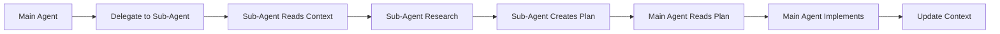

# Agent Plans Directory

> **Purpose**: This directory contains detailed research and planning documents created by sub-agents. Each sub-agent creates their own plan file based on their research and analysis.

## Directory Structure

```
agent_plans/
├── README.md                    # This file
├── requirements_plan.md         # spec-analyst research output
├── architecture_plan.md         # spec-architect research output
├── development_plan.md          # spec-developer research output
├── backend_plan.md             # backend specialist research output
├── frontend_plan.md            # frontend specialist research output
├── odoo_plan.md               # Odoo specialist research output
├── testing_plan.md            # spec-tester research output
├── ui_ux_plan.md              # UI/UX specialist research output
└── [custom_agent]_plan.md     # Custom agent research output
```

## Plan File Guidelines

### For Sub-Agents Creating Plans

1. **Read Session Context First**
   - Always read `.context/session_context.md` before starting
   - Understand the project goals, constraints, and current status

2. **Research and Analysis**
   - Use your tools (Read, Glob, Grep, WebFetch) to research
   - Analyze existing codebase patterns
   - Review best practices and documentation

3. **Create Detailed Plan**
   - Write a comprehensive plan file in this directory
   - Include specific recommendations and implementation details
   - Provide rationale for your recommendations

4. **Final Message Format**
   ```
   I have completed [DOMAIN] research and analysis. 
   Please review the detailed plan at .context/agent_plans/[AGENT]_plan.md
   ```

### For Main Agent Reading Plans

1. **Read All Relevant Plans**
   - Review all plan files before implementing
   - Look for conflicts or inconsistencies between plans
   - Identify dependencies and integration points

2. **Integrate Recommendations**
   - Combine insights from multiple specialists
   - Make final implementation decisions
   - Resolve any conflicts between specialist recommendations

3. **Update Context**
   - Update session context with implementation decisions
   - Track progress and completed work
   - Document any deviations from plans

## Plan File Template

Each plan file should follow this basic structure:

```markdown
# [Domain] Implementation Plan

> **Created by**: [agent-name]
> **Created at**: [timestamp]
> **Based on**: [reference to session context and requirements]

## Executive Summary
[Brief overview of recommendations]

## Research Findings
[What you discovered during research]

## Recommendations
[Detailed implementation recommendations]

## Implementation Details
[Specific steps and technical details]

## Dependencies and Risks
[Dependencies on other components and potential risks]

## Success Criteria
[How to measure success of implementation]

---
**Note**: This is a research and planning document. 
The main agent will review and implement based on this plan.
```

## Integration Workflow



## Quality Standards

### Plan Quality Criteria
- **Comprehensive**: Covers all aspects of the domain
- **Specific**: Provides actionable implementation details
- **Research-Based**: Shows evidence of thorough research
- **Context-Aware**: Considers project constraints and decisions
- **Integration-Ready**: Considers how recommendations fit with other plans

### Review Checklist
- [ ] Plan addresses all requirements in the domain
- [ ] Recommendations are specific and actionable
- [ ] Dependencies and risks are identified
- [ ] Plan considers existing codebase patterns
- [ ] Implementation steps are clear and logical

---

**Template Version**: 1.0
**Last Updated**: [TIMESTAMP]