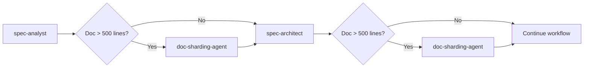

# Document Sharding Guide

Comprehensive guide for using the document sharding functionality in Claude Sub-Agent Spec Workflow System.

## Overview

Document sharding splits large markdown files into manageable, focused fragments to improve:
- **AI Processing**: Smaller documents are more effective for AI analysis
- **Collaboration**: Multiple team members can work on different sections
- **Maintenance**: Focused fragments are easier to update and review
- **Navigation**: Well-structured documentation hierarchy

## Getting Started

### Quick Start

```bash
# Shard a single document
/shard-document docs/requirements.md

# Auto-shard all large documents
/shard-document docs/ --auto

# Use agent directly
Use doc-sharding-agent: Shard the architecture.md document
```

### Installation

The sharding system is pre-configured in claude-sub-agent. To use in your project:

1. **Copy agents and commands**:
```bash
cp agents/utility/doc-sharding-agent.md .claude/agents/
cp commands/shard-document.md .claude/commands/
```

2. **Copy configuration template**:
```bash
cp .claude/sharding-config.yaml your-project/.claude/
```

3. **Customize configuration** for your project needs.

## System Components

### 1. doc-sharding-agent

**Purpose**: Specialized sub-agent for document fragmentation
**Location**: `agents/utility/doc-sharding-agent.md`
**Capabilities**:
- Parse markdown documents by level 2 sections (##)
- Intelligent heading level adjustment
- Code block and diagram preservation
- Generate navigation index files

**Usage**:
```bash
Use doc-sharding-agent: Shard docs/requirements.md into focused sections
Use doc-sharding-agent: Process all documents in specs/ directory above 400 lines
```

### 2. /shard-document Command

**Purpose**: Slash command for flexible document sharding
**Location**: `commands/shard-document.md`
**Features**:
- Batch processing with pattern matching
- Configurable thresholds and options
- Dry-run mode for preview
- Integration with workflow automation

**Usage Examples**:
```bash
# Basic sharding
/shard-document docs/architecture.md

# Custom threshold
/shard-document specs/api.md --threshold=300

# Batch processing with preview
/shard-document docs/ --auto --dry-run
```

### 3. Configuration System

**Purpose**: Centralized control of sharding behavior
**Location**: `.claude/sharding-config.yaml`
**Key Settings**:
- Document type specific thresholds
- File naming conventions
- Content preservation rules
- Workflow integration options

## How Document Sharding Works

### Step-by-Step Process

1. **Document Analysis**
   - Count total lines and sections
   - Identify level 2 headings (##) as natural boundaries
   - Detect special content (code blocks, diagrams, tables)

2. **Structure Planning**
   - Determine fragment boundaries
   - Plan file naming scheme
   - Validate content can be meaningfully separated

3. **Content Extraction**
   - Extract each ## section with all subsections
   - Preserve formatting, code blocks, and diagrams
   - Handle edge cases like ## inside code blocks

4. **File Generation**
   - Create target directory structure
   - Generate individual fragment files
   - Adjust heading levels (## → #, ### → ##)
   - Create comprehensive index file

### Example Transformation

**Before Sharding** - Single large file:
```
requirements.md (847 lines)
├── # Project Requirements
├── ## Business Requirements (189 lines)
├── ## Functional Specifications (298 lines)
├── ## Non-Functional Requirements (156 lines)
└── ## Acceptance Criteria (204 lines)
```

**After Sharding** - Organized directory:
```
requirements/
├── index.md (overview + navigation)
├── business-requirements.md (189 lines)
├── functional-specifications.md (298 lines)
├── non-functional-requirements.md (156 lines)
└── acceptance-criteria.md (204 lines)
```

## Integration with Agent Workflow

### Automatic Integration

The sharding system is integrated into the standard agent workflow:



### Manual Integration

You can manually invoke sharding at any point:

```bash
# After generating requirements
Use spec-analyst: Create detailed requirements for inventory system
# Then manually shard if needed
Use doc-sharding-agent: Shard the generated requirements document

# Or use slash command
/shard-document docs/requirements.md
```

## Configuration Guide

### Basic Configuration

Edit `.claude/sharding-config.yaml`:

```yaml
sharding:
  enabled: true
  threshold: 500           # Auto-shard documents > 500 lines
  min_sections: 2          # Require at least 2 sections
  
naming:
  use_numbers: true        # 01_section.md vs section.md
  case_style: "kebab-case" # section-name vs section_name
  index_name: "index"      # index.md vs 00_main.md
```

### Document-Specific Settings

Configure different thresholds for different document types:

```yaml
documents:
  requirements:
    threshold: 400
    output_pattern: "docs/requirements/{section}"
  
  architecture:
    threshold: 600
    output_pattern: "docs/architecture/{section}"
  
  api-docs:
    threshold: 800
    preserve_examples: true
```

### Workflow Integration

Control automatic sharding in agent workflows:

```yaml
workflow:
  auto_shard_after:
    - "spec-analyst"
    - "spec-architect"
  workflow_threshold: 400
  notify_agents: true
```

## Best Practices

### When to Shard Documents

**✅ Good Candidates for Sharding:**
- Requirements documents > 500 lines
- Architecture specs with multiple components
- API documentation with many endpoints
- User manuals with distinct chapters
- Complex technical specifications

**❌ Keep as Single Files:**
- Simple README files < 300 lines
- Changelogs and release notes
- Glossaries and reference materials
- Documents with heavy cross-referencing

### Optimal Section Structure

**Good Section Structure:**
```markdown
# Main Document
## Business Requirements    (150-300 lines)
## Technical Architecture   (200-400 lines)
## Implementation Details   (100-250 lines)
## Testing Strategy         (100-200 lines)
```

**Problematic Structure:**
```markdown
# Main Document
## Overview                 (50 lines)
## Very Long Section        (800 lines)
## Small Section            (30 lines)
```

### File Organization

**Recommended Directory Structure:**
```
docs/
├── requirements/
│   ├── index.md
│   ├── business-requirements.md
│   ├── technical-requirements.md
│   └── acceptance-criteria.md
├── architecture/
│   ├── index.md
│   ├── system-overview.md
│   ├── component-design.md
│   └── data-architecture.md
└── api-docs/
    ├── index.md
    ├── authentication.md
    ├── endpoints.md
    └── examples.md
```

## Troubleshooting

### Common Issues

#### 1. Section Detection Problems

**Issue**: Sharding creates too many/few fragments
**Solution**: Check for proper ## heading structure
```markdown
# ✅ Good - Clear level 2 sections
## User Authentication
## Data Management
## Reporting Features

# ❌ Bad - Mixed heading levels
### User Authentication
## Data Management  
#### Reporting Features
```

#### 2. Content Loss

**Issue**: Code blocks or diagrams broken across fragments
**Solution**: Use content validation in config
```yaml
quality:
  validate_results: true
  content_integrity_check: true
  max_content_diff: 0.1
```

#### 3. Link Breakage

**Issue**: Internal links break after sharding
**Solution**: Use relative links and enable link validation
```yaml
preservation:
  links: true
quality:
  link_validation: true
```

#### 4. Heading Level Issues

**Issue**: Incorrect heading adjustments
**Solution**: Configure heading rules
```yaml
headings:
  auto_adjust: true
  adjustment_rules:
    h2_becomes: "h1"
    h3_becomes: "h2"
```

### Recovery Strategies

#### Restore from Backup

```bash
# Automatic backup is created before sharding
ls .claude/backups/sharding/
# Restore if needed
cp .claude/backups/sharding/requirements.backup.20250813.md docs/requirements.md
```

#### Validate Sharding

```bash
# Use dry-run to preview before executing
/shard-document docs/requirements.md --dry-run

# Validate results after sharding
Use doc-sharding-agent: Validate the sharded requirements directory
```

## Advanced Usage

### Custom Sharding Logic

For complex documents, you can create custom sharding rules:

```yaml
advanced:
  section_pattern: "^##\s+(?:Chapter|Section)\s+\d+:\s*(.+)$"
  content_filters:
    remove_todos: true
    remove_draft_markers: true
```

### Integration with CI/CD

Automate documentation sharding in your build process:

```bash
# In your CI pipeline
if [ -f "docs/requirements.md" ]; then
  lines=$(wc -l < docs/requirements.md)
  if [ $lines -gt 500 ]; then
    /shard-document docs/requirements.md
  fi
fi
```

### Multiple Language Support

For multilingual projects:

```yaml
documents:
  requirements_en:
    threshold: 500
    output_pattern: "docs/en/requirements/{section}"
  requirements_zh:
    threshold: 500
    output_pattern: "docs/zh/requirements/{section}"
```

## Examples

### Basic Requirements Document

**Input**: `docs/requirements.md` (650 lines)

```markdown
# Project Requirements

## Executive Summary
[75 lines of content]

## Business Requirements  
[200 lines of content]

## Technical Requirements
[180 lines of content]

## Acceptance Criteria
[195 lines of content]
```

**Command**: 
```bash
/shard-document docs/requirements.md
```

**Output**: `docs/requirements/`
```
├── index.md (navigation + exec summary)
├── business-requirements.md
├── technical-requirements.md  
└── acceptance-criteria.md
```

### Architecture Documentation

**Input**: `docs/architecture.md` (980 lines)

**Command**:
```bash
Use doc-sharding-agent: Shard docs/architecture.md with custom naming
```

**Output**: `docs/architecture/`
```
├── index.md
├── 01_system-overview.md
├── 02_component-architecture.md
├── 03_database-design.md
├── 04_api-specifications.md
├── 05_security-framework.md
└── 06_deployment-strategy.md
```

### Batch Processing

**Command**:
```bash
/shard-document docs/ --auto --threshold=400
```

**Output**:
```
✅ Processed 3 documents:
- requirements.md → requirements/ (4 sections)
- architecture.md → architecture/ (6 sections)  
- api-documentation.md → api-documentation/ (5 sections)

⏭️ Skipped 2 documents (below threshold):
- README.md (156 lines)
- changelog.md (89 lines)
```

## Reference

### Available Commands

| Command | Purpose | Example |
|---------|---------|---------|
| `/shard-document` | Shard specific document | `/shard-document docs/file.md` |
| `/shard-document --auto` | Auto-shard directory | `/shard-document docs/ --auto` |
| `/shard-document --dry-run` | Preview sharding | `/shard-document --dry docs/` |
| `Use doc-sharding-agent` | Agent-based sharding | Direct agent invocation |

### Configuration Keys

| Setting | Type | Default | Description |
|---------|------|---------|-------------|
| `threshold` | int | 500 | Min lines for sharding |
| `min_sections` | int | 2 | Min sections required |
| `use_numbers` | bool | true | Number file prefixes |
| `case_style` | string | kebab-case | Filename convention |
| `auto_adjust` | bool | true | Adjust heading levels |

### File Extensions

| Extension | Purpose | Generated |
|-----------|---------|-----------|
| `.md` | Markdown fragments | Always |
| `.backup.*.md` | Original backups | If enabled |
| `index.md` | Navigation index | Always |

---

This guide provides comprehensive coverage of the document sharding system. For additional support, refer to the individual agent documentation or configuration comments in the YAML files.