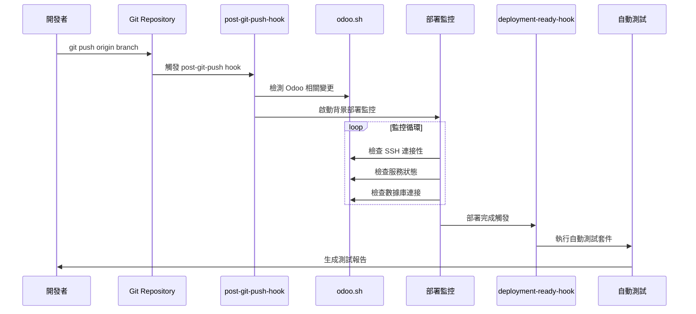

# Claude Code Hooks 整合指南

## 概述

Claude Code Hooks 提供事件驅動的自動化機制，專為 odoo.sh 部署流程設計。本指南說明如何配置和使用基於 Hook 的解決方案來自動監控部署進度並觸發測試。

## Hook 系統架構

### 事件流程



## Hook 檔案說明

### 1. post-git-push-hook.sh

**功能：** 在 git push 操作後自動觸發的部署監控器

**關鍵特性：**
- 智能檢測 Odoo 相關變更
- 啟動背景部署監控進程
- 支援多種監控策略
- 完整的錯誤處理和日誌記錄

**核心監控指標：**
```bash
deployment_indicators = {
    "ssh_connectivity": 20,      # SSH 連接可用性（20%）
    "service_responsiveness": 25, # Odoo 服務響應（25%）
    "recent_restart": 20,        # 服務重啟檢測（20%）
    "database_accessibility": 20, # 數據庫連接（20%）
    "log_activity": 15          # 日誌活動（15%）
}
```

### 2. deployment-ready-hook.sh

**功能：** 當部署監控檢測到就緒狀態時自動觸發測試

**關鍵特性：**
- 自動執行全面測試套件
- 生成詳細的測試報告
- 提供成功/失敗通知
- 創建可行動的後續步驟建議

## 安裝和配置

### 1. 基本安裝

```bash
# 複製 hooks 到 Claude Code 目錄
cp -r hooks/*.sh .claude/hooks/

# 使 hooks 可執行
chmod +x .claude/hooks/*.sh
```

### 2. 配置 odoo.sh 環境

創建或更新 `.claude/config/odoo-sh.json`：

```json
{
  "environments": {
    "staging": {
      "ssh_host": "your-user@your-project-stage.dev.odoo.com",
      "ssh_key_path": "~/.ssh/odoo_sh_key",
      "active": true,
      "deployment_timeout": 600
    },
    "production": {
      "ssh_host": "your-user@your-project-prod.odoo.com",
      "ssh_key_path": "~/.ssh/odoo_sh_key",
      "active": false,
      "deployment_timeout": 900
    }
  },
  "default_environment": "staging",
  "deployment_monitoring": {
    "strategy": "status_polling",
    "odoo_sh_polling": {
      "check_interval": 30,
      "max_attempts": 20,
      "stability_checks": 3
    },
    "time_based": {
      "base_wait_time": 300,
      "health_check_interval": 60
    }
  },
  "test_settings": {
    "default_modules": ["ai_chat", "ai_config", "ai_config_gemini"],
    "test_timeout": 300,
    "parallel_testing": false
  }
}
```

### 3. Hook 註冊（Claude Code 整合）

Hooks 會自動由 Claude Code 的 Hook 系統檢測。確保檔案位於正確位置：

```text
.claude/
├── hooks/
│   ├── post-git-push-hook.sh
│   └── deployment-ready-hook.sh
├── config/
│   └── odoo-sh.json
└── ...
```

## 使用方式

### 自動觸發（推薦）

Hooks 會在以下情況自動觸發：

```bash
# 正常的 git 工作流程
git add .
git commit -m "Implement new feature"
git push origin v18-dev25

# Hook 系統會自動：
# 1. 檢測到 git push 操作
# 2. 分析變更是否影響 Odoo 模組
# 3. 啟動背景部署監控
# 4. 在部署完成時觸發測試
```

### 手動監控和控制

```bash
# 查看實時監控日誌
tail -f .claude/config/deployment-hooks.log

# 檢查活動的監控進程
ps aux | grep deployment-monitor

# 停止監控進程（如需要）
kill $(cat .claude/config/deployment-monitor.pid)

# 查看最新的測試報告
ls -la .claude/config/deployment-test-report-*.md
```

## 監控策略詳解

### 狀態輪詢監控（預設）

```bash
# 監控指標權重系統
function calculate_completion_score() {
    local ssh_ok=0
    local service_ok=0
    local restart_ok=0
    local db_ok=0
    local logs_ok=0
    
    # SSH 連接性檢查 (20%)
    if ssh_connectivity_test; then
        ssh_ok=20
    fi
    
    # 服務響應性檢查 (25%)
    if service_responsiveness_test; then
        service_ok=25
    fi
    
    # 近期重啟檢查 (20%)
    if recent_restart_test; then
        restart_ok=20
    fi
    
    # 數據庫可訪問性檢查 (20%)
    if database_accessibility_test; then
        db_ok=20
    fi
    
    # 日誌活動檢查 (15%)
    if log_activity_test; then
        logs_ok=15
    fi
    
    total_score=$((ssh_ok + service_ok + restart_ok + db_ok + logs_ok))
    
    # 當總分 ≥ 80 時認為部署完成
    echo $total_score
}
```

### 時間基礎等待

適用於網絡不穩定或 SSH 訪問受限的環境：

```json
{
  "deployment_monitoring": {
    "strategy": "time_based",
    "time_based": {
      "base_wait_time": 450,        // 基礎等待時間（秒）
      "health_check_interval": 90,  // 健康檢查間隔
      "max_wait_time": 900         // 最大等待時間
    }
  }
}
```

## 測試報告格式

### 自動生成的測試報告

```markdown
# 🧪 自動部署測試報告

**生成時間**: 2024-08-14 15:30:25  
**環境**: staging  
**觸發器**: Deployment Ready Hook  

## 📊 測試摘要

- **總測試數**: 3
- **通過**: 3  
- **失敗**: 0
- **成功率**: 100%

## 📋 模組測試結果

- ✅ **ai_config**: PASSED
- ✅ **ai_chat**: PASSED
- ✅ **ai_config_gemini**: PASSED

## 🔗 快速操作

```bash
# 查看詳細日誌
ssh staging-host "tail -100 ~/logs/odoo.log"

# 重新運行失敗的測試
ssh staging-host "odoo-bin --test-enable --test-tags=FAILED_MODULE --stop-after-init --log-level=test"

# 訪問 Odoo shell 進行除錯
ssh staging-host "odoo-bin shell"
```

## 📈 後續步驟

✅ **部署成功** - 可以使用
- 所有關鍵測試已通過
- 服務穩定運行
- 考慮推向生產環境（如果這是測試環境）

---
*報告由 Claude Code Deployment Hook 生成*
```

## 故障排除

### 常見問題

1. **Hook 未觸發**
   ```bash
   # 檢查 Hook 檔案權限
   ls -la .claude/hooks/
   
   # 確保檔案可執行
   chmod +x .claude/hooks/*.sh
   
   # 檢查 Claude Code Hook 系統狀態
   # （具體指令依 Claude Code 版本而定）
   ```

2. **SSH 連接失敗**
   ```bash
   # 測試 SSH 連接
   ssh your-user@your-project-stage.dev.odoo.com "echo 'Connection test'"
   
   # 檢查 SSH 金鑰
   ssh-add -l
   
   # 更新配置中的 SSH 主機
   vim .claude/config/odoo-sh.json
   ```

3. **監控進程異常**
   ```bash
   # 檢查監控日誌
   tail -50 .claude/config/deployment-hooks.log
   
   # 清理舊的監控進程
   pkill -f deployment-monitor
   
   # 重新啟動監控
   # 推送新的更改將自動重啟監控
   ```

### 調試模式

啟用詳細日誌記錄：

```bash
# 在 hook 檔案中設置調試模式
export HOOK_DEBUG=1

# 或在配置中啟用
echo '{"debug_mode": true}' > .claude/config/debug-settings.json
```

## 最佳實踐

### 1. 環境配置

- 為不同環境（開發、測試、生產）設置不同的超時時間
- 使用適當的監控間隔避免過度輪詢
- 配置合理的重試次數和退避策略

### 2. 安全考慮

- 使用專用的 SSH 金鑰
- 限制 Hook 腳本的檔案權限
- 定期輪換 SSH 憑證
- 避免在日誌中記錄敏感信息

### 3. 性能優化

- 根據網絡條件調整檢查間隔
- 使用並行檢查提高效率
- 監控系統資源使用情況
- 定期清理舊的日誌和報告檔案

### 4. 團隊協作

- 確保所有團隊成員了解 Hook 系統
- 建立 Hook 失敗時的應急程序
- 定期審查和更新 Hook 配置
- 保持清晰的部署文檔

## 與現有工作流程整合

### BMad-Method 故事驅動開發

```bash
# Hook 系統可以與故事追蹤整合
# 在測試完成後自動更新故事進度

# 故事完成檢查
if [ $success_rate -ge 95 ]; then
    # 觸發故事進度更新
    echo "story_completed: epic-1-story-2.3" >> .claude/config/story-updates.log
fi
```

### 持續集成流水線

```yaml
# GitHub Actions 整合範例
name: Deploy with Hook Monitoring
on:
  push:
    branches: [v18-dev25]

jobs:
  deploy:
    runs-on: ubuntu-latest
    steps:
      - uses: actions/checkout@v3
      - name: Deploy and Monitor
        run: |
          # 推送將自動觸發 Hook 系統
          git push origin v18-dev25
          
          # 等待 Hook 系統完成
          timeout 900 bash -c 'while [ ! -f .claude/config/deployment-complete ]; do sleep 30; done'
```

## 總結

Claude Code Hooks 為 odoo.sh 部署提供了完全自動化的解決方案：

✅ **事件驅動** - 無需手動干預  
✅ **智能監控** - 多層指標檢測  
✅ **自動測試** - 部署完成時立即驗證  
✅ **詳細報告** - 全面的部署和測試信息  
✅ **錯誤處理** - 強健的重試和恢復機制  
✅ **團隊友好** - 清晰的通知和可行動建議  

這個 Hook 基礎解決方案讓開發團隊可以專注於代碼開發，而無需擔心複雜的部署時序問題。