# Structured Response System for Sub-Agents

## 🎯 Overview

This document describes the **structured response system** that enables optimal sub-agent coordination while following Claude Code sub-agent best practices. This system addresses the core issue of sub-agents needing to share detailed research without violating the principle that sub-agents should be researchers, not implementers.

## 🔍 Problem Statement

### Traditional Sub-Agent Issues
```yaml
❌ Common Anti-Patterns:
  - Sub-agents directly implement code
  - Sub-agents write files with implementation tools
  - High token consumption in conversation context
  - Lost context due to conversation compression
  - Sub-agents lack full context for debugging

✅ Optimal Sub-Agent Design:
  - Sub-agents research and recommend only
  - Main agent implements based on research
  - File system used for context sharing
  - Token efficiency through structured responses
  - Clear separation of concerns
```

## 🏗️ System Architecture

### Research → Implementation Flow

```mermaid
graph LR
    A[Main Agent] --> B[Create Context Files]
    B --> C[Delegate Research to Sub-Agent]
    C --> D[Sub-Agent Reads Context]
    D --> E[Sub-Agent Researches]
    E --> F[Sub-Agent Returns Structured Response]
    F --> G[Main Agent Parses Response]
    G --> H[Main Agent Creates Plan File]
    H --> I[Main Agent Implements Code]
    I --> J[Update Context]
    
    style D fill:#e1f5fe
    style E fill:#e8f5e8
    style F fill:#fff3e0
    style I fill:#ffebee
```



### Tool Distribution

```yaml
Sub-Agents (Research Only):
  tools: [Read, Glob, Grep, mcp__context7__*]
  forbidden: [Write, Edit, MultiEdit, Bash, TodoWrite]
  
Main Agent (Implementation):
  tools: [All tools including Write, Edit, MultiEdit, Bash]
  role: Implementation based on sub-agent research
```

## 📝 Structured Response Format

### Universal Response Structure

All sub-agents MUST use this exact format for responses:

```
=== [DOMAIN] RESEARCH RESULTS START ===

## Executive Summary
[Brief overview of findings and recommendations]

## [Domain-Specific Sections]
[Detailed research findings organized by domain]

## Implementation Recommendations
[Specific, actionable implementation guidance]

## Risk Assessment and Mitigation
[Identified risks and mitigation strategies]

## Success Criteria and Validation
[How to measure successful implementation]

=== [DOMAIN] RESEARCH RESULTS END ===
```

### Domain-Specific Response Formats

#### 1. Development Research (spec-developer)
```
=== DEVELOPMENT RESEARCH RESULTS START ===

## Executive Summary
[Implementation approach and key recommendations]

## Codebase Analysis Results
### Existing Patterns Found
### Code Quality Assessment
### Module Dependencies

## Technical Implementation Strategy
### Recommended Implementation Approach
### Development Phases Recommendation
### Architecture Recommendations

## Code Organization Strategy
### Recommended File Structure
### Naming Conventions

## Reusability Analysis
### Existing Components to Extend
### New Reusable Components to Create

## Quality Assurance Recommendations
### Testing Strategy
### Code Quality Standards

## Risk Assessment and Mitigation
### Technical Risks Identified
### Implementation Challenges

## Performance Optimization Strategy
### Database Optimization
### ORM Optimization
### Caching Strategy

## Integration Requirements
### Internal Integration
### External Integration
### API Design

## Implementation Timeline Estimates
### Task Complexity Assessment
### Critical Path Analysis
### Milestone Recommendations

## Success Criteria and Validation
### Implementation Success Metrics
### Quality Validation Criteria
### Performance Validation

## Next Steps Recommendations
### Immediate Actions
### Implementation Sequence
### Resource Requirements

=== DEVELOPMENT RESEARCH RESULTS END ===
```

#### 2. Backend Architecture Research (odoo18-backend-architect)
```
=== BACKEND ARCHITECTURE RESEARCH START ===

## Executive Summary
[Backend architecture requirements and recommended approach]

## Business Requirements Analysis
### Core Business Logic Requirements
### Workflow and State Management
### Data and Integration Requirements

## Existing Pattern Analysis
### Current Model Patterns Found
### Business Logic Patterns Identified
### ORM Optimization Patterns

## Recommended Backend Architecture
### Model Architecture Design
### Business Logic Architecture

## Performance Architecture
### Database Design Recommendations
### ORM Performance Strategy

## Enterprise Architecture Patterns
### Multi-Company Implementation
### Security Architecture
### Audit and Compliance

## Integration Architecture
### API Design Recommendations
### External System Integration

## Scalability and High Availability
### Horizontal Scaling Strategy
### Load Balancing
### Database Scaling
### Caching Layer

## Implementation Planning
### Development Phases
### Migration Strategy
### Testing Strategy

## Risk Assessment and Mitigation
### Technical Risks
### Performance Risks
### Security Risks

## Quality Standards and Validation
### Code Quality Standards
### Performance Benchmarks
### Security Standards
### Documentation Requirements

## Implementation Guidelines
### Development Best Practices
### Code Organization
### Testing Requirements
### Deployment Strategy

## Success Metrics and Validation
### Architecture Success Criteria
### Performance Validation
### Security Validation
### Scalability Validation

=== BACKEND ARCHITECTURE RESEARCH END ===
```

#### 3. Frontend Architecture Research (odoo18-frontend-architect)
```
=== FRONTEND ARCHITECTURE RESEARCH START ===

## Executive Summary
[Frontend architecture requirements and recommended OWL approach]

## UI/UX Requirements Analysis
### User Interface Requirements
### User Experience Requirements
### Data and State Requirements

## Existing Pattern Analysis
### Current OWL Component Patterns Found
### JavaScript Architecture Patterns
### UI/UX Patterns Identified
### Performance Optimization Patterns

## Recommended Frontend Architecture
### OWL Component Architecture
### JavaScript Architecture
### UI/UX Architecture

## Performance Architecture
### Loading and Rendering Strategy
### Runtime Performance

## Integration Architecture
### Backend Integration
### Third-party Integration
### Progressive Web App Features

## Responsive and Mobile Architecture
### Mobile-First Design
### Cross-Device Compatibility
### Touch and Gesture Support
### Performance on Mobile

## Implementation Planning
### Development Phases
### Component Development Strategy
### Asset Management

## Risk Assessment and Mitigation
### Technical Risks
### Performance Risks
### User Experience Risks
### Browser Compatibility Risks

## Quality Standards and Validation
### Code Quality Standards
### Performance Benchmarks
### Accessibility Standards
### Cross-Browser Testing
### User Experience Validation

## Implementation Guidelines
### Development Best Practices
### Code Organization
### Testing Requirements
### Build and Deployment
### Documentation Standards

## Success Metrics and Validation
### Architecture Success Criteria
### Performance Validation
### User Experience Validation
### Accessibility Validation
### Cross-Platform Validation

=== FRONTEND ARCHITECTURE RESEARCH END ===
```

#### 4. View Generation Research (odoo18-view-generator)
```
=== VIEW GENERATION RESEARCH START ===

## Executive Summary
[View requirements and recommended XML generation approach]

## Model Analysis Results
### Target Models for View Generation
### Field Analysis by Model

## Existing View Pattern Analysis
### Current View Patterns Found
### Layout and Organization Patterns
### Action and Menu Patterns

## Recommended View Architecture
### Form View Design Strategy
### List View Design Strategy
### Kanban View Design Strategy
### Search View Design Strategy

## Menu and Action Architecture
### Menu Structure Recommendations
### Action Configuration Recommendations

## Security Integration Recommendations
### Access Control Configuration
### Record Rules (if needed)

## Performance Optimization Recommendations
### View Performance Strategy
### Responsive Design Strategy

## Implementation Planning
### View Generation Phases
### Testing Strategy
### Documentation Requirements

## Quality Standards and Validation
### View Quality Criteria
### Validation Checklist

## Risk Assessment and Mitigation
### View Implementation Risks
### Performance Risks
### User Experience Risks

## Success Metrics and Implementation Guidelines
### View Generation Success Criteria
### User Adoption Metrics
### Performance Benchmarks
### Maintenance Guidelines

=== VIEW GENERATION RESEARCH END ===
```

## 🔄 Main Agent Processing Workflow

### 1. Response Parsing
```python
def parse_sub_agent_response(response_text):
    """Parse structured sub-agent response"""
    # Extract content between markers
    start_marker = "=== [DOMAIN] RESEARCH RESULTS START ==="
    end_marker = "=== [DOMAIN] RESEARCH RESULTS END ==="
    
    # Parse structured content
    structured_data = extract_sections(response_text)
    return structured_data
```

### 2. Plan File Creation
```python
def create_plan_file(agent_name, structured_response):
    """Create plan file from sub-agent research"""
    plan_content = format_plan_file(structured_response)
    
    # Write to .context/agent_plans/
    plan_file = f".context/agent_plans/{agent_name}_plan.md"
    write_file(plan_file, plan_content)
    
    # Update session context
    update_session_context(agent_name, "completed")
```

### 3. Implementation Based on Plans
```python
def implement_from_plans():
    """Implement based on all sub-agent research"""
    # Read all plan files
    plans = read_all_plans(".context/agent_plans/")
    
    # Integrate recommendations
    integrated_plan = integrate_research_findings(plans)
    
    # Execute implementation
    implement_solution(integrated_plan)
    
    # Update context
    update_development_context("implementation_complete")
```

## 🎯 Benefits of Structured Response System

### Token Efficiency
```yaml
Traditional Approach:
  - Sub-agent reads files → adds to conversation context
  - Multiple file reads → exponential context growth
  - Conversation compression → lost context
  - Result: High token usage, degraded performance

Structured Response Approach:
  - Sub-agent research → structured summary response
  - Main agent creates plan files → file system context
  - No conversation pollution from file contents
  - Result: 10x token efficiency, maintained context
```

### Clear Separation of Concerns
```yaml
Sub-Agent Responsibilities:
  ✅ Research existing patterns
  ✅ Analyze requirements
  ✅ Recommend implementation strategies
  ✅ Identify risks and mitigation
  ❌ Write implementation code
  ❌ Create actual files
  ❌ Execute bash commands

Main Agent Responsibilities:
  ✅ Create and manage context files
  ✅ Parse sub-agent research
  ✅ Create plan files from research
  ✅ Implement actual code
  ✅ Handle debugging and fixes
  ✅ Coordinate overall workflow
```

### Enhanced Coordination
```yaml
Context Management:
  - Persistent project state in .context/
  - Incremental research building
  - Cross-agent research integration
  - Clear handoff protocols

Quality Assurance:
  - Structured research validation
  - Comprehensive implementation guidance
  - Risk-aware development
  - Evidence-based decisions
```

## 📋 Implementation Checklist

### For Sub-Agents
- [ ] Remove Write, Edit, MultiEdit, Bash tools
- [ ] Update agent descriptions to emphasize research role
- [ ] Implement structured response format
- [ ] Include comprehensive research workflow
- [ ] Define clear success criteria

### For Main Agent Workflow
- [ ] Create context management system
- [ ] Implement response parsing logic
- [ ] Create plan file generation system
- [ ] Build integrated implementation workflow
- [ ] Add context update mechanisms

### For Project Setup
- [ ] Copy context templates to .context/
- [ ] Update .gitignore to exclude .context/
- [ ] Update README with installation instructions
- [ ] Test workflow with sample project
- [ ] Document best practices

## 🚀 Expected Outcomes

### Immediate Benefits
- **10x Token Efficiency**: Dramatic reduction in conversation context pollution
- **Improved Research Quality**: Sub-agents focus purely on analysis and recommendation
- **Better Implementation**: Main agent has complete context for debugging and fixes
- **Clear Accountability**: Research vs. implementation responsibilities are distinct

### Long-term Benefits
- **Scalable Workflow**: Can handle large, complex projects without context limits
- **Consistent Quality**: Structured research ensures comprehensive coverage
- **Maintainable Process**: Clear separation makes workflow easier to debug and improve
- **Team Collaboration**: Multiple developers can follow the same systematic approach

## 🔧 Troubleshooting

### Common Issues
1. **Sub-agent trying to write files**: Remove Write tools from agent definition
2. **Inconsistent response format**: Validate response format in agent prompts
3. **Missing research sections**: Update agent templates with complete structure
4. **Context file conflicts**: Implement proper file locking and update protocols

### Quality Validation
1. **Research Completeness**: Verify all required sections are present
2. **Implementation Readiness**: Ensure recommendations are actionable
3. **Risk Coverage**: Validate that risks and mitigations are identified
4. **Success Criteria**: Confirm measurable success criteria are defined

This structured response system transforms the sub-agent workflow from an inefficient multi-implementer model to an efficient research-and-implement model that follows Claude Code best practices while maximizing development effectiveness.